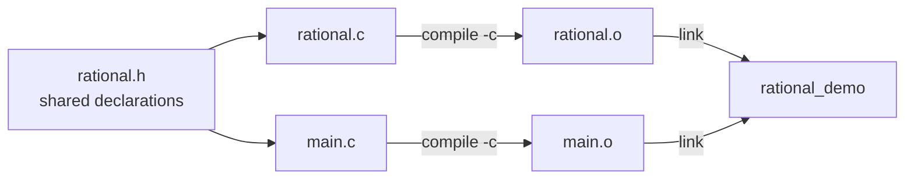
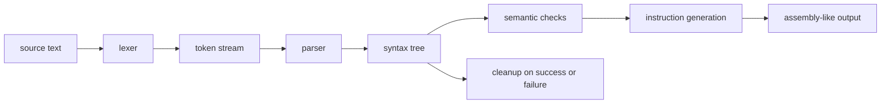

# 第 3 週課堂講義 — Structures、Modules、Builds 與 Debugging

> 2026 年 9 月 22 日 · 來源沿革：先前的 structures、multi-file build、
> program-style 與 debugging 講義

> Python 銜接：[第 3 週 Python 對照補充教材](week03_python_companion.md)

---

## 學習路線

- **核心：**陳述一個 `struct` invariant、區分 declarations 與 definitions、
  compile 多個 translation units，並根據證據診斷一項故障。
- **練習：**完成[第 3 週練習](lecture_exercises/week03_ex.md)，
  再與[完整範例](examples.c)比較。
- **輔助概念：**build-system 提供的便利功能很實用，但必須掌握的
  模型是 source files 轉為 object files，再成為一個 linked program。
- **Python 銜接：**當 fixed-layout records 或 separate
  compilation 沒有直接對應的 Python 概念時，請使用補充教材。

---

## 學習目標

完成本次課堂後，你應該能夠：

1. 適當使用 `struct`、`enum` 與 `typedef` 建立 record 模型。
2. 將 public interface 與 private implementation 分開。
3. 解釋 declarations、definitions、object files 與 link errors。
4. Build 並 debug 一個 multi-file C 程式。
5. 陳述並檢查 representation invariants。

---

## 三小時課程規劃

| 小時 | 主要問題 | 課堂產出 |
|------|---------------|---------------------|
| 1 | records 如何成為可靠的 abstractions？ | 設計具有 invariants 的 tokens 與 rational values |
| 2 | source files 如何成為一個程式？ | Build 一個 three-file module 並診斷 link failures |
| 3 | tests 與 tools 如何把故障轉為證據？ | Debug 一項刻意置入的 multi-file 缺陷，並新增 regression test |

每小時交錯安排約 35–45 分鐘的講解與現場寫程式，
以及約 15–20 分鐘的核心練習。其餘時間用於提問、
課程銜接與短暫休息。如果班上需要更多時間掌握核心概念，標示為 **延伸** 的練習
可以移到 lab 或自主學習時進行。

### 隨堂練習流程

每個**立即練習**活動都遵循相同的簡短循環：

1. 預測結果、state change、build artifact 或 diagnostic；
2. 撰寫或修改最小的相關片段；
3. 使用 `-std=c17 -Wall -Wextra -Wpedantic` compile C；
4. 執行指定的一般案例與 boundary cases；以及
5. 說明哪個 representation invariant 或 build rule 能支持這個結果。

一開始只顯示題目。完成並檢查嘗試後，再開啟**展開解答**。
每份解答會指出預期輸出、build
證據，或只有 declaration 的範例為何沒有 run-time output。

- **課堂核心：**屬於規劃中的課堂學習路線。
- **延伸：**供 lab、課間休息或日後自學使用的額外練習。

課堂核心練習在第 1 小時合計約 19 分鐘、第 2 小時約 17 分鐘，
第 3 小時約 19 分鐘。

---

## 第 1 小時 — Records、tagged data 與 invariants

> **第 1 小時路線：**[Structures 會把相關的值組合在一起](#1-structures-會把相關的值組合在一起)
> → [使用 `enum` 的 tagged alternatives](#2-使用-enum-的-tagged-alternatives)
> → [Invariants 讓 records 成為 abstractions](#3-invariants-讓-records-成為-abstractions)
> → [Designated initializers 與 partial initialization](#designated-initializers-與-partial-initialization)
> → [Tagged unions](#tagged-unions)
> → [設計練習](#立即練習-課堂核心--第-1-小時設計練習5-分鐘)

### 1. Structures 會把相關的值組合在一起

Python dictionary 或簡單的 class 可以組合不同種類的 fields。在 C 中，
對應的作法是宣告固定的 members 集合與順序。compiler 會選擇
依 target 而定的 offsets，並可能在 members 之間插入 padding，但每個
`struct Student` object 在同一個程式內都有相同的 representation：

```c
#include <stdio.h>

struct Student {
  int id;
  char name[32];
  double grade;
};

int main(void) {
  struct Student student = {1001, "Ada", 92.5};
  printf("%s: %.1f\n", student.name, student.grade);
  return 0;
}
```

```text
one Student object (conceptual, not to scale)
┌────────┬──────────────────────────────┬──────────┬─────────┐
│ id     │ name[0] ... name[31]        │ padding? │ grade   │
└────────┴──────────────────────────────┴──────────┴─────────┘
```

Member 順序會保留，但確切的 offsets、padding 與總大小由
implementation 決定。需要實際 object 大小時，請使用 `sizeof(struct Student)`；
不要手動相加各 member 的大小來計算。

dot operator 會選取 structure object 的一個 member。這裡的 `student.name` 是
內嵌的 32-element character array，而 `student.grade` 是 `double`。
positional initializer 遵循 member 順序；後面介紹的 designated initializers
會明確表達這些對應關係。

完整程式會印出：

```text
Ada: 92.5
```

在同一個 block 內，從另一個 structure 進行 assignment 或 initialization，
會將所有 members 複製到另一個獨立的 structure object：

```c
struct Student copy = student;
```

array member 會隨 structure 一起複製，即使獨立的
array 無法被 assigned。相較之下，pointer member 只會複製它的 pointer
value；不會複製該 pointer 所指向的另一個 object。
以 pass by value 傳遞 structure 也會複製所有 members。當
function 必須修改 caller 的 record，或複製大型 record 會產生
不必要的成本時，請傳遞 pointer。

#### 立即練習 [課堂核心] — 觀察 structure copy（3 分鐘）

從上面的完整程式開始。加入 `copy` 到 `main` 內，將
`copy.name[0]` 改為 `'E'`，並將 `copy.grade` 改為 `88.0`。印出兩個 records。
預測修改 copy 是否也會改變
`student` 內嵌的 array 或 grade。

<details>
<summary>展開解答</summary>

這個 `main` 應放在上面的 `struct Student` declaration 之後：

```c
#include <stdio.h>

int main(void) {
  struct Student student = {1001, "Ada", 92.5};
  struct Student copy = student;
  copy.name[0] = 'E';
  copy.grade = 88.0;

  printf("original=%s %.1f\n", student.name, student.grade);
  printf("copy=%s %.1f\n", copy.name, copy.grade);
  return 0;
}
```

Structure assignment 複製了每個 member，包含
`name` 的全部 32 個 elements。因此，兩個 records 包含彼此獨立的 arrays。

**預期輸出：**

```text
original=Ada 92.5
copy=Eda 88.0
```

</details>

---

### 2. 使用 `enum` 的 tagged alternatives

```c
enum TokenKind { TokenInteger, TokenPlus, TokenMinus, TokenEnd, TokenInvalid };

struct Token {
  enum TokenKind kind;
  int value;
};
```

`enum` 為有限集合中的 integral cases 命名。type 為
`enum TokenKind` 的 variable 應包含其中一個已宣告的 alternatives。`kind`
member 告訴我們其餘 fields 是否具有意義：`value` 只有在
`kind == TokenInteger` 時才存放 parsed integer。這項 tag-first 規則會成為
representation invariant 的一部分，之後也會支援 compiler 專案中的 tokens 與 syntax-tree
nodes。

使用 `typedef` 為實用的 abstraction 命名，而不是隱藏每個 type：

```c
typedef struct Token Token;
```

`struct Token` 與 `Token` 都是課程中合理的寫法；請保持一致。

`typedef` 為現有的 type 引入 alias；它不會 allocate
object、產生 run-time conversion，或定義第二種 representation。

#### 立即練習 [課堂核心] — 讓 tag 決定解讀方式（3 分鐘）

建立一個包含 `17` 的 integer token，以及一個 plus token。第一個印出 `integer 17`，
第二個印出 `plus`。只有在 integer case 才讀取 `value`。

<details>
<summary>展開解答</summary>

這個 `main` 使用上面的 `enum TokenKind`、`struct Token` 與 `Token` alias：

```c
#include <stddef.h>
#include <stdio.h>

int main(void) {
  Token integer_token = {TokenInteger, 17};
  Token plus_token = {TokenPlus, 0};
  Token tokens[] = {integer_token, plus_token};

  for (size_t i = 0; i < 2; ++i) {
    if (tokens[i].kind == TokenInteger) {
      printf("integer %d\n", tokens[i].value);
    } else if (tokens[i].kind == TokenPlus) {
      printf("plus\n");
    }
  }
  return 0;
}
```

loop 會先檢查 tag，再讀取 integer payload。

**預期輸出：**

```text
integer 17
plus
```

</details>

---

### 3. Invariants 讓 records 成為 abstractions

representation invariant 是一項必須成立的性質：只要 clients 能透過
public interface 觀察 object，就必須滿足它。它把許多可能的 field
組合限縮為程式承諾能理解的 states。以 normalized form 的 rational
number 為例：

- denominator 不為零；
- denominator 為正；
- numerator 與 denominator 除了 1 以外沒有 common factor。

```c
#include <stdbool.h>

typedef struct Rational {
  int numerator;
  int denominator;
} Rational;

bool rational_make(int numerator, int denominator, Rational* out);
```

這個類似 constructor 的 function，只有在提供 normalized value 之後才回傳 `true`；
value 會透過 `out` 提供。它的 contract 要求有效的 output pointer、拒絕
值為零的 denominator，並在失敗時維持 destination 不變。本課程的
implementation 也拒絕任一 numeric argument 為 `INT_MIN`，以確保
normalization algorithm 執行的每次 negation 都能被表示，
不必依賴 implementation 的 signed range 是否對稱。
完整 implementation 會在第 2 小時作為 multi-file module 的一部分出現；
獨立的 starter 會要求你先嘗試，再展開該 implementation。

不要讓每個 caller 都得重新摸索這些規則。如果所有 public creation 與
mutation paths 都能建立 invariant，後續 functions 就能基於單一
canonical representation 推理：例如 `1/2`，而不是 `2/4`、`-1/-2` 或 `3/6`。

#### 立即練習 [課堂核心] — 先在紙上進行 normalize（4 分鐘）

對下面每個 request，預測成功或失敗，以及成功時儲存的
members。先不要撰寫 implementation。

- `rational_make(6, 8, &value)`
- `rational_make(2, -4, &value)`
- `rational_make(0, 5, &value)`
- `rational_make(1, 0, &value)`
- `rational_make(1, 2, NULL)`

<details>
<summary>展開解答</summary>

| Request | 狀態 | 儲存的 value 或原因 |
|---------|--------|------------------------|
| `6, 8, &value` | 成功 | 除以 common factor 2 後成為 `3/4` |
| `2, -4, &value` | 成功 | `-1/2`；denominator 變為正值 |
| `0, 5, &value` | 成功 | `0/1`；零有唯一的 canonical denominator |
| `1, 0, &value` | 失敗 | rational denominator 不能為零 |
| `1, 2, NULL` | 失敗 | 沒有有效的 destination 可接收結果 |

這是 contract trace，並非 executable 程式，因此沒有 standard
output。失敗的 call 必須維持先前的 destination value 不變。

</details>

---

### Designated initializers 與 partial initialization

> **輔助 C 語法：**designated initializers 讓 records 更清楚，
> 但理解 structure members 與 invariants 比
> 記住這種 initializer 形式更重要。

C designated initializers 明確表達 field 的意義，也比 positional initialization
更能適應 field 順序的變更：

```c
struct Student student = {.id = 1001, .name = "Ada", .grade = 92.5};
```

未指定的 members 會 initialized 為零。這與未 initialized 的
automatic structure 不同；後者的 members 具有 indeterminate values。

#### 立即練習 [延伸] — 檢查 partial initialization（2 分鐘）

只 initialize `.id`（位於 `struct Student`），再印出 ID、
`name[0]` 的 numeric value 與 grade。在 compiling 之前預測兩個 implicit values。

<details>
<summary>展開解答</summary>

這個 `main` 使用上面的 `struct Student` definition：

```c
#include <stdio.h>

int main(void) {
  struct Student partial = {.id = 1002};
  printf("id=%d first-name-byte=%d grade=%.1f\n", partial.id,
         partial.name[0], partial.grade);
  return 0;
}
```

因為這個 declaration 包含 initializer，每個未提及的 member 與
array element 都會 zero-initialized。

**預期輸出：**

```text
id=1002 first-name-byte=0 grade=0.0
```

</details>

---

### Tagged unions

> **面向專案的 representation：**tagged unions 為第 7 週使用的 token 與
> syntax-tree alternatives 做準備。當每個 member 都同時存在時，
> 它們不能取代一般的 `struct`。

`union` 讓多個 members 重疊在相同的 storage 中，因此同一時間只有一個 member 的
value 是 active。由於單靠 storage 無法記住哪個
member 是 active，可靠的程式會將 union 與 `enum` tag 配對：

```c
enum ValueKind { ValueInteger, ValueReal, ValueError };

struct Value {
  enum ValueKind kind;
  union {
    long integer;
    double real;
    const char* error;
  } as;
};
```

讀取與 `kind` 不一致的 union member 會違反 abstraction。這種
tag 與多個 alternative payloads 的組合，是用來表示
「這些 cases 中恰好一個」的通用技巧。每個讀取
payload 的 function 都必須先檢查 tag，而每個改變 case 的 function
都必須同時更新 tag 與 payload。

`error` alternative 是指向現有 null-terminated
string 的 borrowed pointer。structure 不會 own 或複製該 string，因此指向的文字
必須在每次使用 `Value` 時都保持有效。string literal 在整個程式期間
都滿足這項 lifetime 要求。

```c
#include <stdio.h>

void value_print(struct Value value) {
  switch (value.kind) {
    case ValueInteger:
      printf("integer=%ld\n", value.as.integer);
      break;
    case ValueReal:
      printf("real=%.1f\n", value.as.real);
      break;
    case ValueError:
      printf("error=%s\n", value.as.error);
      break;
  }
}
```

這個 function 以 pass by value 接收這個小型教學 record。它會先檢查 `kind`，
再選取對應的 nested member，例如 `value.as.real`。

#### 立即練習 [課堂核心] — 保持 tag 與 payload 同步（4 分鐘）

使用 designated initializers 建立每種 kind 各一個 value，呼叫
`value_print` 並預測 output。接著說明為何 construction 後只改變 `.kind`
會破壞 invariant。

<details>
<summary>展開解答</summary>

這個 `main` 使用上面的 `ValueKind`、`Value` 與 `value_print` definitions：

```c
int main(void) {
  struct Value count = {.kind = ValueInteger, .as.integer = 42};
  struct Value ratio = {.kind = ValueReal, .as.real = 3.5};
  struct Value failure = {.kind = ValueError, .as.error = "bad input"};

  value_print(count);
  value_print(ratio);
  value_print(failure);
  return 0;
}
```

**預期輸出：**

```text
integer=42
real=3.5
error=bad input
```

若只把 `ratio.kind` 改為 `ValueInteger`，tag 就會宣稱
重疊的 bytes 中存放的是 `long`，即使最後儲存的 union
member 是 `real`。public operation 必須同時更新這兩部分。

</details>

---

### 立即練習 [課堂核心] — 第 1 小時設計練習（5 分鐘）

設計 `struct Date` 與 functions `date_make`、`date_next`、`date_print`。
決定哪些 representation 與 operations 應放在 public header。陳述
閏年與有效日期的 invariants，並提供二月、月份
交替與無效 construction 的 boundary tests。第 4 週之後，再思考將
representation 隱藏在 opaque pointer 後面，對 interface 的改善
是否足以抵銷其 ownership 成本。

<details>
<summary>展開解答</summary>

一個一致的 public 設計如下：

```c
#include <stdbool.h>
#include <stdio.h>

typedef struct Date {
  int year;
  int month;
  int day;
} Date;

bool date_make(int year, int month, int day, Date* out);
bool date_next(Date current, Date* out);
void date_print(FILE* stream, Date value);
```

invariant 要求 `1 <= month && month <= 12`，且 day 必須介於 1 與
該年該月的天數之間。閏年可被
4 整除，但可被 100 整除的年份不是閏年，除非也可被 400 整除。
operations 也必須說明支援的年份範圍，以及
下一個日期超出該範圍時會發生什麼事。

最少應有的 boundary tests 包括平年與閏年的 2 月 28 日、
閏年的 2 月 29 日、30 天月份的最後一天、12 月 31 日、月份
0、月份 13，以及略低於與略高於某月份有效範圍的日期。這些是
declarations 與 test 要求，因此在提供 implementations 與 driver
之前，這個設計不會產生 run-time output。

</details>

---

## 第 2 小時 — Headers、preprocessor 與 build graph

> **第 2 小時路線：**[Interfaces 放在 headers 中](#4-interfaces-放在-headers-中)
> → [Separate compilation 與 linking](#5-separate-compilation-與-linking)
> → [先掌握 encapsulation，再談 opaque ownership](#先掌握-encapsulation再談-opaque-ownership)
> → [Preprocessor 使用原則](#preprocessor-使用原則)
> → [最小的 Makefile](#最小的-makefile)
> → [故障 lab](#第-2-小時故障-lab)

### 4. Interfaces 放在 headers 中

`rational.h`:

```c
#ifndef RATIONAL_H
#define RATIONAL_H

#include <stdbool.h>
#include <stdio.h>

typedef struct Rational {
  int numerator;
  int denominator;
} Rational;

bool rational_make(int numerator, int denominator, Rational* out);
void rational_print(FILE* stream, const Rational* value);

#endif
```

header 包含 implementation 與 clients 都需要的 public type 與 function declarations。
它具有 **self-contained** 特性：source file 可以
先 include `rational.h`，而不必依賴另一個 header 來定義 `bool` 或
`FILE`。

這三個 preprocessor directives 構成 **header guard**。第一次
inclusion 時，`RATIONAL_H` 尚未 defined，因此 declarations 會保留，
macro 也會變成 defined。重複 inclusion 時，會跳過所有內容，直到
對應的 `#endif`，避免在同一個 translation
unit 內出現重複 declarations。guard 名稱必須為這個 header 所獨有。

`FILE` 是由 `<stdio.h>` 宣告的 standard-library type。`FILE*` 是
handle，functions 透過它讀取或寫入 stream，例如 standard output
或已開啟的檔案。這個 interface 接受 stream，因此格式化邏輯
不會綁定在 `stdout` 上；pointer 是 borrowed，且不會由
`rational_print` 關閉。

#### 立即練習 [課堂核心] — 分類 header declarations（3 分鐘）

對 `rational.h` 的每一行，判斷它提供的是 type definition、
function declaration、dependency，還是 preprocessor guard。接著回答：為什麼
header 宣告 `rational_make`，卻不宣告 private greatest-common-
divisor helper？

<details>
<summary>展開解答</summary>

- `<stdbool.h>` 與 `<stdio.h>` 提供 public declarations 使用的 types。
- 受 guard 保護的 `typedef struct Rational ... Rational;` 定義可見的 record
  與其 alias。
- 兩個 prototypes 宣告 public operations，但不定義它們的 bodies。
- private helper 只應放在 `rational.c` 中；公開它會擴大
  public interface，卻無助於 clients 使用 rational values。
- `#ifndef`、`#define` 與 `#endif` 會防止同一個
  translation unit 內重複 inclusion。

header 只會作為 include 它的 source file 的一部分進行 translation。因此，這些
declarations 本身不會產生 executable，也不會產生 run-time output。

</details>

implementation 會先 include 自己的 header。這會立即揭露
不具 self-contained 特性的 header，並讓 compiler 比較每個 definition
與已公布的 declaration。

下面出現一種新的 member 寫法：`out->numerator` 是
`(*out).numerator` 的簡寫 — 先 dereference structure pointer，再選取 member。
第一次使用 `->` 之前必須先檢查有效性。implementation 也
使用 `assert`，在開發期間檢查遭到違反的 internal precondition；第
3 小時會解釋 assertion 行為，以及為何 assertions 無法取代一般的 input
validation。

<details>
<summary>嘗試 starter constructor 後，展開 `rational.c`</summary>

```c
#include "rational.h"

#include <assert.h>
#include <limits.h>

static int gcd_positive(int left, int right) {
  if (left < 0) {
    left = -left;
  }
  if (right < 0) {
    right = -right;
  }
  while (right != 0) {
    const int remainder = left % right;
    left = right;
    right = remainder;
  }
  if (left == 0) {
    return 1;
  }
  return left;
}

bool rational_make(int numerator, int denominator, Rational* out) {
  if (out == NULL || denominator == 0 || numerator == INT_MIN ||
      denominator == INT_MIN) {
    return false;
  }
  if (denominator < 0) {
    numerator = -numerator;
    denominator = -denominator;
  }
  const int divisor = gcd_positive(numerator, denominator);
  out->numerator = numerator / divisor;
  out->denominator = denominator / divisor;
  return true;
}

void rational_print(FILE* stream, const Rational* value) {
  assert(stream != NULL);
  assert(value != NULL);
  assert(value->denominator > 0);
  fprintf(stream, "%d/%d", value->numerator, value->denominator);
}
```

`static` 讓 `gcd_positive` 具有 internal linkage，因此其他 translation units
不能以名稱使用該 helper。construction 失敗時，會在任何 output
member 改變之前 return。這個教學 representation 拒絕 `INT_MIN`；正式使用的
numeric type 應明確記錄或重新設計這項 range 限制。

`rational.c` 沒有 `main`，因此單獨使用 `-c` compile 它會產生 object
file，但不會產生 run-time output。

</details>

client 包含程式的 entry point，並且只使用 public header：

`main.c`:

```c
#include "rational.h"

#include <stdio.h>

int main(void) {
  Rational value;
  if (!rational_make(2, -4, &value)) {
    fputs("could not construct rational value\n", stderr);
    return 1;
  }
  rational_print(stdout, &value);
  fputc('\n', stdout);
  return 0;
}
```

#### 立即練習 [課堂核心] — build 並執行 module（5 分鐘）

完全依照範例建立這三個檔案。預測哪個 command 會產生各個
object file，以及哪個 command 會產生 executable。Build 並執行
程式，再將 request 改為 `6/8`，不要修改 `rational.c`。

<details>
<summary>展開解答</summary>

```sh
cc -std=c17 -Wall -Wextra -Wpedantic -g -c rational.c -o rational.o
cc -std=c17 -Wall -Wextra -Wpedantic -g -c main.c -o main.o
cc rational.o main.o -o rational_demo
./rational_demo
```

成功的 build commands 通常不會印出任何內容。它們產生的檔案依序是
`rational.o`、`main.o` 與 `rational_demo`。

**`2/-4` 的預期程式輸出：**

```text
-1/2
```

只將 `main.c` 中的 call 改為 `rational_make(6, 8, &value)` 後，
程式會印出：

```text
3/4
```

</details>

---

### 5. Separate compilation 與 linking

每個 `.c` file 都會作為獨立的 **translation unit** 進行 preprocessing 與 compilation。
Include `rational.h` 會將相同的 declarations 複製到兩個 units，但只有
`rational.c` 提供 public function definitions。linker 之後會連接
`main.o` 中的 calls 與 `rational.o` 中的 definitions。

```sh
cc -std=c17 -Wall -Wextra -Wpedantic -g -c rational.c -o rational.o
cc -std=c17 -Wall -Wextra -Wpedantic -g -c main.c -o main.o
cc rational.o main.o -o rational_demo
```



- 每個 `-c` command 都會建立一個 object file，而不進行 linking。
- 最後一個 command 會 resolve cross-file references，並建立 executable。
- **implicit declaration** diagnostic 通常表示編譯某個 call 時，
  沒有可見的 prototype。
- **conflicting types** diagnostic 表示同一個 translation unit 內的 declarations，或 declaration 與
  definition 不一致。
- **multiple definition** link error 表示不只一個 object exports
  相同的一般 definition。
- **undefined reference** link error 表示沒有 linked object 提供
  所需的 definition。

在 implementation file 中，先 include 自己的 header。如果 header 不具
self-contained 特性，這個錯誤就能在接近來源的位置被發現。

#### 立即練習 [課堂核心] — 在 build graph 中找出責任歸屬（4 分鐘）

對每個變更，預測最早失敗的 stage 與可能的 diagnostic 類別。
每次只測試一個變更，並在繼續之前還原。

1. 移除 `#include "rational.h"`（位於 `main.c`），但保留 calls。
2. 正確 compile 兩個檔案，但只 link `main.o`。
3. 將 header 的 return type 改為 `int`，但不修改 `rational.c`。
4. 還原每個檔案，並 link 兩個 objects。

<details>
<summary>展開解答</summary>

| 變更 | 最早的證據 | 原因 |
|--------|-------------------|--------|
| `main.c` 中缺少 include | compilation diagnostic | 該 translation unit 中未宣告 `Rational` 與 prototypes |
| 只 link `main.o` | undefined-reference link error | client 呼叫的 functions 定義在被省略的 `rational.o` 中 |
| Header 寫 `int`，source 定義為 `bool` | `rational.c` 中的 conflicting-types compilation diagnostic | implementation 在自己的 definition 之前 include header |
| 還原檔案並 link 兩個 objects | link 成功，且 run time 印出 `-1/2` | declarations 與 definitions 一致，且每個 reference 都有對應內容 |

compilation 或 linking 失敗時，不會產生程式 output，因為沒有建立有效的
executable。確切的 diagnostic 文字依 toolchain 而定。

</details>

---

### 先掌握 encapsulation，再談 opaque ownership

> **設計預告：**當 module 必須隱藏 dynamically owned representation 時，
> opaque pointer interfaces 就會變得重要。本週維持 structure
> 可見，讓 separate-compilation model 仍是主要概念。

module 可以先採用可見的 structure definition，同時仍要求
clients 使用它的 functions：

```c
/* counter.h */
struct Counter {
  long value;
};

void counter_initialize(struct Counter* counter);
void counter_increment(struct Counter* counter);
long counter_value(const struct Counter* counter);
```

可見的 layout 表示 compiler 知道 `Counter` 需要多少 storage，
因此 client 可以直接宣告一個。function contracts 仍集中規範
有效的 initialization 與 state changes。這是基於慣例的
encapsulation：compiler 不會阻止 client 寫入 `value`。

#### 立即練習 [延伸] — 區分 layout 與允許的 operations（3 分鐘）

對 `counter.h` 的每個 declaration，陳述 client 必須建立的條件，
以及 operation 的承諾。哪個直接的 member assignment 即使繞過預期的 interface，
compiler 仍會接受？

<details>
<summary>展開解答</summary>

- `counter_initialize` 要求有效的 writable pointer，並建立
  module 的 initial state。
- `counter_increment` 要求已 initialized 的 writable object，並
  依 module 政策遞增它的 value。
- `counter_value` 要求有效且已 initialized 的 object，不會修改它，並
  回傳觀察到的值。
- 因為 definition 可見，client 仍可以寫
  `counter.value = -100;`。header 傳達慣例，但無法
  阻止這種存取。

header 只包含 declarations，因此不會產生 run-time output。

</details>

更嚴格的設計可以把 members 隱藏在 incomplete，也就是 **opaque** 的
structure type 後面。這通常要求 clients 操作 pointers，並
帶來 allocation 與 destruction 的問題。第 4 週會先介紹必要的
pointer、lifetime 與 ownership model，再呈現這種 interface。
這個順序很重要：只有當我們也能說明
誰會 create、own 與 destroy 隱藏的 object，隱藏 representation 才有用。

---

### Preprocessor 使用原則

> **輔助 C 工具：**辨識 header guards 與簡單的 macros，但
> 一般程式邏輯應優先使用 typed functions 與 constants。

Object-like macros 會進行 token substitution，且沒有 type：

```c
#define BUFFER_CAPACITY 256
```

Function-like macros 可能對 arguments evaluate 不只一次：

```c
#define BAD_SQUARE(x) ((x) * (x))
/* BAD_SQUARE(i++) modifies i twice without sequencing: undefined behavior. */
```

若能表達相同意圖，請優先使用 `enum` constants、`const` objects 與 functions。
將 conditional compilation 用於實際的 platform 或 build 選擇，
不要用它在同一個檔案中隱藏多個不相關的 implementations。

#### 立即練習 [延伸] — 執行之前先檢查 substitution（3 分鐘）

手動展開 `BAD_SQUARE(i++)`。不要執行展開後的 expression。將
macro 換成只 evaluate argument 一次的 typed function，再用一般的 value
測試這個 function。

<details>
<summary>展開解答</summary>

Textual substitution 會產生：

```c
((i++) * (i++))
```

對 `i` 的兩次 unsequenced modifications 讓 expression 成為 undefined。增加
parentheses 無法修復 multiple evaluation。function 會在 call 之前 evaluate
argument，再透過 parameter 使用得到的 value：

```c
int square(int value) {
  return value * value;
}
```

對於 square 能以 `int` 表示的 inputs，`printf("%d\n", square(5));`
會印出：

```text
25
```

</details>

---

### 最小的 Makefile

> **工具參考：**學生必須理解 compile 與 link
> commands。記住 Makefile 語法並非 C-language 的學習目標。

```make
CC = cc
CFLAGS = -std=c17 -Wall -Wextra -Wpedantic -g

rational_demo: main.o rational.o
	$(CC) main.o rational.o -o rational_demo

main.o: main.c rational.h
	$(CC) $(CFLAGS) -c main.c

rational.o: rational.c rational.h
	$(CC) $(CFLAGS) -c rational.c
```

dependency edges 說明 header 變更之後必須 rebuilt 哪些內容。Make
不是 compiler；它會決定哪些 compiler/linker commands 已過時。

縮排的 recipe lines 必須以 tab 開始，因為這個字元屬於
傳統 Makefile 語法的一部分。variables 可以減少重複；`$(CC)` 與
`$(CFLAGS)` 會由 Make 展開，再執行產生的 shell command。

#### 立即練習 [延伸] — 預測 rebuild 集合（4 分鐘）

成功執行一次 `make rational_demo` 後，預測只 touching
`main.c`、只 touching `rational.c`，以及接著 touching `rational.h` 時會執行哪些 commands。請從
dependency lines 解釋每個答案，而不是背誦 Make 的行為。

<details>
<summary>展開解答</summary>

| 變更的檔案 | 重新 compiled 的 objects | 是否 relink？ |
|--------------|--------------------|---------|
| `main.c` | `main.o` | 是 |
| `rational.c` | `rational.o` | 是 |
| `rational.h` | `main.o` 與 `rational.o` 兩者 | 是 |

如果每個 target 都已比其 prerequisites 更新，Make 通常會回報
target 已是最新，且不執行任何 recipe。確切的狀態文字
依 implementation 而定；上面的 dependency 判斷才是要求掌握的
結果。

**預期 terminal 證據：**除非 recipes 設為不顯示，否則 Make 會印出
它決定執行的每個 compiler 或 linker command。表格預測了這組
commands；這個 Makefile 不會執行程式本身。

</details>

---

### 第 2 小時故障 lab

#### 立即練習 [課堂核心] — 分類五種故障（5 分鐘）

在 three-file 程式中置入並分類這些缺陷：

1. 在 Makefile 中省略 header dependency；
2. 宣告 `double mean(...)`，但定義 `int mean(...)`；
3. 在兩個 source files 中定義同名的非 `static` helper；
4. 將 function definition 放在兩個 source files 都會 include 的 header 中；
5. 變更 function body，卻未 relinking。

對每一項，找出最早能偵測該缺陷的 stage。

<details>
<summary>展開解答</summary>

| 置入的缺陷 | 第一項可靠證據 |
|---------------|-------------------------|
| Makefile 中省略 Header dependency | header 變更後出現 stale-build failure；Make 錯誤地跳過 source view 已過時的 object |
| Header 宣告 `double mean(...)`，source 定義 `int mean(...)` 並 include 該 header | compile-time conflicting-types diagnostic |
| 兩個 source files export 相同的非 `static` helper | multiple-definition link error |
| 一般 function definition 放在兩個 source files 都會 include 的 header 中 | 每個 file 都能 compile，接著 linking 回報 multiple definitions |
| Function body 變更，但 executable 未 relinked | 過時的 executable 不會提供 diagnostic；其行為與 timestamps 顯示新的 object 未被納入 |

缺少 Make dependency 是 build-graph 缺陷，而非 C diagnostic。
它可能一直隱藏到 header 變更才出現，因此單靠 clean build
無法證明 dependency declarations 完整。失敗的 builds 沒有
run-time output，因為預期的 executable 未被產生或更新。

</details>

---

## 第 3 小時 — Assertions、file boundaries、tests 與 debugging

> **第 3 小時路線：**[Assertions、tests 與 debugger 證據](#6-assertionstests-與-debugger-證據)
> → [File I/O 是另一個 contract boundary](#file-io-是另一個-contract-boundary)
> → [Debugging 工作坊：先看 invariant](#debugging-工作坊先看-invariant)
> → [Style 作為 correctness 工具](#7-style-作為-correctness-工具)
> → [專案 pipeline map](#期中專案連結--修改之前先建立-map)

### 6. Assertions、tests 與 debugger 證據

對代表 programmer error 的 internal conditions 使用 assertions：

```c
#include <assert.h>
#include <stddef.h>

int array_sum(const int values[], size_t count) {
  assert(values != NULL || count == 0);
  int total = 0;
  for (size_t i = 0; i < count; ++i) {
    total += values[i];
  }
  return total;
}
```

這個教學版本要求數學上的 sum 必須能以
`int` 表示。對 unrestricted inputs 的 interface 必須使用 checked arithmetic，或
明確回報 overflow。

`assert(condition)` 是來自 `<assert.h>` 的 macro。在啟用 assertion 的 build 中，
當 condition 為 false，implementation 會回報 diagnostic context，
並以異常方式終止程式。確切文字不具 portable 特性。在
`NDEBUG` 在 include `<assert.h>` 之前被定義時，通常是透過 compiler option
`-DNDEBUG`，就會停用 assertions。因此：

- 對表示 programming 缺陷的 internal assumptions 違反，
  使用 assertions；
- 使用一般 control flow 驗證 malformed input、缺少檔案與其他預期的 failures；
  以及
- 絕對不要把必要的 assignment、function call 或其他 side effect
  只放在 assertion 裡。

#### 立即練習 [課堂核心] — 區分受檢查的 invariant 與 input handling（4 分鐘）

呼叫 `array_sum`，分別使用 `{4, -1, 3}` 與 `NULL`（`count == 0`）。預測兩個
結果。接著分類 `array_sum(NULL, 1)`，但不要執行：啟用
assertion 的 build 會偵測什麼？為何停用 assertions 也無法讓這個
call 變得有效？

<details>
<summary>展開解答</summary>

```c
#include <stdio.h>

int main(void) {
  int values[] = {4, -1, 3};
  printf("sum=%d empty=%d\n", array_sum(values, 3), array_sum(NULL, 0));
  return 0;
}
```

**預期輸出：**

```text
sum=6 empty=0
```

對 `array_sum(NULL, 1)` 而言，assertion condition 為 false；啟用的
assertion 應在 loop dereferences `NULL` 之前終止程式。
使用 `NDEBUG` 時，這項檢查會消失，後續的 access 就是 undefined
behavior。precondition 在每個 build 中都仍是 interface 的一部分，因此
不要把無效的 call 當成一般 test 來執行。

</details>

實用的 debugging loop 如下：

1. 重現最小的 failing input。
2. 陳述預期行為與觀察到的行為。
3. 使用 warnings 與 sanitizers 進行 Compile。
4. 在 debugger 中停在相關的程式行。
5. 檢查 control flow 與 data；不要盲目猜測。
6. 在修復之前或同時加入 regression test。

<details>
<summary>補充說明 — build 一個 instrumented executable</summary>

在提供 AddressSanitizer 與 UndefinedBehavior-
Sanitizer 的 compiler 與 platform 上，diagnostic build 通常使用：

```sh
cc -std=c17 -Wall -Wextra -Wpedantic -g -O0 \
  -fsanitize=address,undefined -fno-omit-frame-pointer \
  main.c rational.c -o rational_demo_sanitized
```

`-O0` 讓 source/debugger 的對應關係保持直接，
`-fsanitize=address,undefined` 加入對支援的 memory 與
undefined-behavior 類別的 run-time checks，而 `-fno-omit-frame-pointer` 通常可改善
diagnostic stack traces。這些 options 是 compiler 提供的功能，而非 C17
language features；可用性會因 toolchain 而異。

成功的 compilation 通常不會印出任何內容。執行有效的 test
也可能沒有 sanitizer 訊息；沒有 report 只涵蓋
已執行的 paths，無法證明整個程式都正確。

</details>

常見的 debugger commands 包括 `break`、`run`、`next`、`step`、`print` 與
`backtrace`。請學會概念；確切的 command 寫法會因 debugger 而異。

---

### File I/O 是另一個 contract boundary

> **輔助 interface 技巧：**stream parameters 讓程式碼可以測試，但
> 核心重點仍是陳述 input、output 與 failure contracts。

本講義前面的 header 範例介紹了 `FILE*` 作為 borrowed stream
handle。module 可以接受這種 handle，而不必開啟 hard-coded path：

```c
#include <stdbool.h>
#include <stddef.h>
#include <stdio.h>

bool students_read(FILE* input, struct Student students[], size_t capacity,
                   size_t* count) {
  if (input == NULL || count == NULL || (students == NULL && capacity != 0)) {
    return false;
  }
  *count = 0;
  while (*count < capacity) {
    struct Student next;
    const int converted =
        fscanf(input, "%d %31s %lf", &next.id, next.name, &next.grade);
    if (converted == EOF) {
      return feof(input) != 0;
    }
    if (converted != 3) {
      return false;
    }
    students[(*count)++] = next;
  }
  const int extra = fscanf(input, "%*s");
  return extra == EOF && feof(input) != 0;
}
```

接收 `FILE*` 讓 parser 可以透過 redirected files 或 temporary
streams 測試。它也將「bytes 從哪裡來」與「records 如何
parsed」分開。record grammar 是三個以 whitespace 分隔的 fields：`int` ID、
最多儲存 31 個 characters 的 word，以及 `double` grade。如第 1 週所述，
contract 假設 numeric tokens 能以 destination types 表示。

function 會立即提供每個完整的 record。如果後續 record
malformed，它會回傳 `false`，而 `*count` 等於先前已儲存的有效
records 數量。array 達到 capacity 之後，suppressed `%*s`
conversion 會檢查是否還有額外的 token：有 token 時，call 會回傳零，
function 就會拒絕 input；正常的 end-of-file 會回傳 `EOF`，且 stream 的
end indicator 已設定。Read errors 會被拒絕，不會與一般的
end-of-file 混淆。

#### 立即練習 [課堂核心] — 追蹤 stream contract（5 分鐘）

在 capacity 為 2 時，預測每個 input 的 return status 與最後的 count。
指出已提供了哪些 records（如果有的話）。

1. `1001 Ada 92.5 1002 Lin 88`
2. 空的 input
3. `1001 Ada x`
4. `1001 Ada 92.5 1002 Lin 88 1003 Chen 75`

<details>
<summary>展開解答</summary>

| Input | 狀態 | `count` | 已提供的 records |
|-------|--------|---------|-------------------|
| 兩個完整的 records | `true` | `2` | Ada 與 Lin |
| 空的 input | `true` | `0` | 無 |
| 第一個 record 的 grade 無效 | `false` | `0` | 無 |
| 三個 records，但 capacity 為 2 | `false` | `2` | Ada 與 Lin；額外的 token 證明已超過 record capacity |

這是 control-flow trace，因此 function 本身不會寫入任何 standard output。
caller 決定是否回報 `false` 結果，以及如何回報。

</details>

---

### Debugging 工作坊：先看 invariant

置入一個具體缺陷：暫時移除 `denominator < 0` normalization
block（位於 `rational_make`）。request `2/-4` 就可能提供 `1/-2`，違反
positive-denominator invariant。請依照這個順序操作：

1. 在 public observation points 加入 `assert(value->denominator > 0)`；
2. 建立能觸發 assertion 的最小 input；
3. 在 `rational_make` 中設定 break，並檢查兩個 numeric parameters 在
   缺少 normalization 的位置前後的值；
4. 找出哪個 operation 繞過了 normalization；
5. 修復 public mutation path；
6. 新增同時檢查 value 與 invariant 的 regression test；
7. 使用 sanitizers 執行完整的 test set。

assertion 本身不是修復。它將較遠處的錯誤 output，轉為
invariant 首次可被觀察到的 boundary 上的 failure。

#### 立即練習 [課堂核心] — 修復之前先記錄證據（5 分鐘）

進行置入缺陷的實驗。記錄 requested value、錯誤地
提供的 members、assertion boundary 與最小修復。新增 test，
同時測試 `2/-4` 與 `-2/-4`，讓修復後的 sign logic 在兩個
方向都被執行。

<details>
<summary>展開解答</summary>

沒有 sign normalization 時，`gcd_positive(2, -4)` 回傳 2，construction
則提供 `1/-2`。`rational_print` 中的 assertion 會在將其呈現為有效的
rational value 之前，偵測出無效的 denominator。最小修復是
在計算 divisor 之前還原這個 block：

```c
if (denominator < 0) {
  numerator = -numerator;
  denominator = -denominator;
}
```

修復之後，`2/-4` 變為 `-1/2`，而 `-2/-4` 變為 `1/2`。regression
test 應檢查兩個 members，而非只檢查印出的文字：

```c
Rational value;
bool made = rational_make(2, -4, &value);
assert(made);
assert(value.numerator == -1 && value.denominator == 2);
made = rational_make(-2, -4, &value);
assert(made);
assert(value.numerator == 1 && value.denominator == 2);
```

當每個 condition 都為 true 時，Assertions 不會產生 standard output。test
driver 可以在所有 checks 通過後，另外印出成功訊息。

</details>

---

### 7. Style 作為 correctness 工具

- 讓每個 function 都有一項明確責任。
- 使用能表達 units 與 roles 的名稱（`capacity`、`student_count`）。
- 用 named constants 取代沒有解釋的 magic values。
- 將 declarations 放在接近第一次使用的位置。
- 對 function 不得修改的 data，使用 `const`。
- 記錄令人意外的選擇為何正確，而不是解釋顯而易見的語法在做什麼。

#### 立即練習 [延伸] — 變更行為之前，先讓 contract 易讀（3 分鐘）

檢視這個 declaration，並指出 caller 無法從名稱得知哪些資訊：

```c
int process(int* a, int n, int m);
```

針對計算 scores 至少達到 threshold 數量的 function，
只改寫 declaration 與簡短的 contract。不要改變 algorithm，因為目前尚未
指定任何 algorithm。

<details>
<summary>展開解答</summary>

更清楚的 interface 如下：

```c
#include <stddef.h>

size_t count_scores_at_least(const int scores[], size_t score_count,
                             int threshold);
```

它的 contract 要求可讀取的 `score_count` 個 integers 範圍，
不修改該範圍，並回傳介於零與 `score_count` 之間的 value。
這些名稱表達了 element 的用途、logical length 與 comparison boundary。
Declarations 本身沒有 run-time output。

</details>

---

## 期中專案連結 — 修改之前先建立 map

expression-compiler scaffold 與其補充工具會在本
週發布。請把它們視為不熟悉的系統，而不是一組可交給
LLM 填寫的空格。
修改程式碼之前，先找出：

- entry point 與 input contract；
- token representation 與 lexer boundary；
- parser 的 input 與 AST output；
- semantic 與 instruction-generation stages；
- allocation、cleanup 與 error-reporting 的責任；
- 每個 TODO 的 precondition 與 postcondition。



沿著現有 stages 追蹤一個 public expression，並記錄
scaffold 哪些部分完整、未完成或刻意簡化。AI 工具可以
協助解釋 function，但學生必須根據實際的
declarations 與一次已執行的 trace 驗證每項說法。星期四的 deliverable 是 build
record 與 pipeline map，而不是 project implementation。

### 立即練習 [課堂核心] — 追蹤一個 expression，不實作 TODOs（5 分鐘）

使用 public expression `12 + 3 * 4`。對 scaffold 中每個可用的
stage，記錄其 input、output、failure signal、任何 allocated
object 的 owner，以及一項已執行的證據。將不可用的 stages 標為 TODOs，
而不是請 AI 工具虛構其行為。

<details>
<summary>展開解答</summary>

有效的 map 應具有以下形式；確切的 type 與 function 名稱必須來自
已發布的 scaffold：

| Stage | 預期的概念結果 | 應記錄的證據 |
|-------|----------------------------|--------------------|
| Input | characters `12 + 3 * 4` | 確切的 testcase 與 entry point |
| Lexer | integer 12、plus、integer 3、star、integer 4、end | token trace 或 debugger 觀察結果 |
| Parser | right child 是 multiplication 的 addition | 顯示 precedence 的 tree dump 或 parser call trace |
| Semantic checks | numeric expression 被接受，或有記錄的 TODO | return status 與 error channel |
| Generator | instructions 在 addition 之前 evaluate multiplication | 產生的文字或有記錄的 TODO |
| Cleanup | 每個成功 allocated 的 node 都在每條 exit path 上 released | cleanup calls、sanitizer 結果或有記錄的缺漏 |

這個區塊說明推理流程，而不是 scaffold 隱藏的
implementation。某個 stage 不會僅因 AI 解釋說它能運作，
就代表它真的能運作；這項說法需要 declaration、call trace、output 或 test 結果支持。

</details>

---

## 自我檢核

1. 哪些 declarations 應放在 public header 中，哪些應維持 private？
2. 為何在 header 中定義一般 function，常會導致 link errors？
3. 你會要求 date structure 具備什麼 invariant？
4. 分類缺少 prototype 與缺少 function body 這兩種情況。
5. 為 `rational_make` 設計三個 tests，包含一個 invalid input。
6. 為何 tagged-union reader 必須先檢查 tag，再讀取 payload？
7. 為何必要的 function call 不能只出現在 `assert(...)` 中？
8. `rational.h` 變更之後，哪些 object files 必須 rebuilt？為什麼？
9. 當後續 record malformed 時，`students_read` 會提供什麼 partial
   result？

---

## 重點整理

- Structures 為相關 fields 提供固定的 layout。
- Enums 明確表達 states 與 tagged alternatives。
- Invariants 將原始 field 組合限縮為有意義的 program states。
- Headers 宣告 contracts；source files 定義行為。
- Compilation 檢查每個 translation unit；linking 將它們連接起來。
- Assertions 診斷 programmer errors，但無法取代 input validation。
- 針對性的 tests、sanitizers 與 debuggers 能將故障轉為證據。

---

## 參考資料與來源教材

- [Structures、enumerations 與相關 C 主題](<https://github.com/htchen/i2p-nthu/blob/master/程式設計一/Supplementary%20Material%202/README.md>)
- [Compiling 多個 source files](<https://github.com/htchen/i2p-nthu/blob/master/程式設計一/如何compile多個檔案/如何%20compile%20多個檔案.md>)
- [Debugging](<https://github.com/htchen/i2p-nthu/blob/master/程式設計一/Programming%20related%20Topic/Debug.md>)
- [Programming style](<https://github.com/htchen/i2p-nthu/blob/master/程式設計一/Programming%20related%20Topic/程式撰寫風格.md>)
