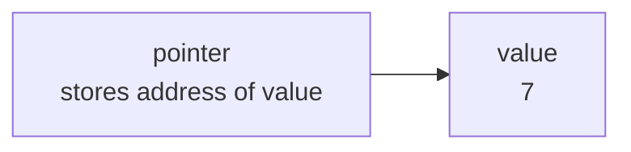
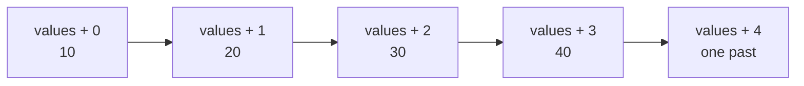
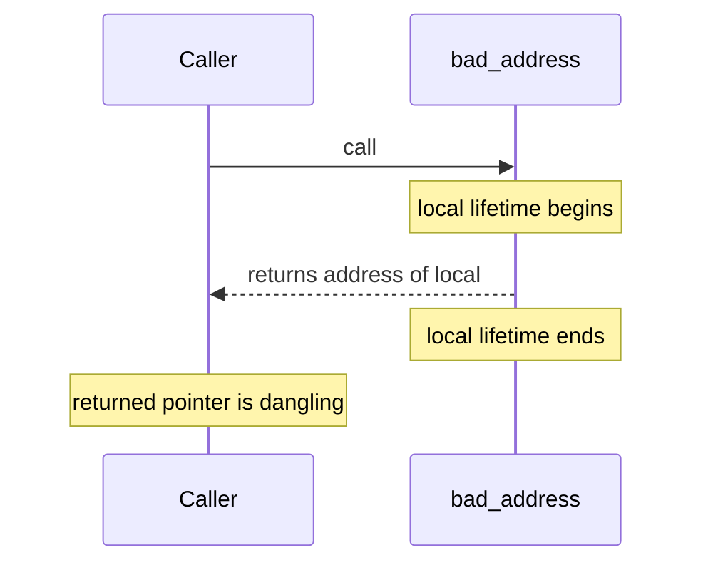
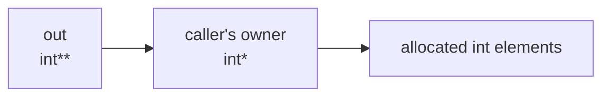
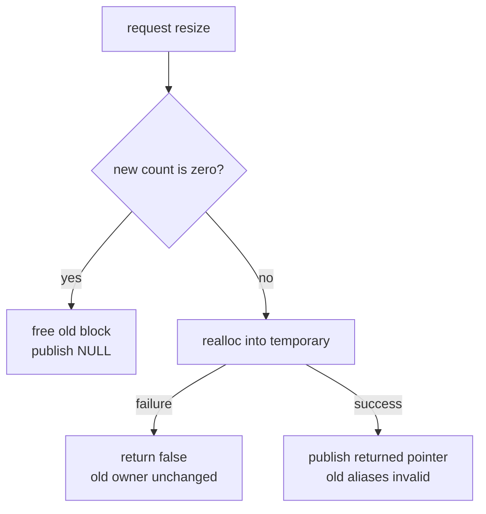

# 第 4 週課堂講義 — Pointers、Lifetime 與 Dynamic Memory

> 2026 年 9 月 29 日 · 來源脈絡：先前的 pointer、dynamic allocation、
> double-pointer 與 linked-data 筆記，以及教師提供的
> *From C to Assembly* 講義

> Python 銜接：[第 4 週 Python 對照補充教材](week04_python_companion.md)

---

## 學習路線

- **核心：** 畫出 pointer 指向的對象，區分 lifetime 與 scope，
  對一個 dynamic array 執行 allocate/resize/free，並說明誰擁有它。
- **練習：** 完成[第 4 週練習](lecture_exercises/week04_ex.md)
  後，再與[完整範例](examples.c)比較。
- **補充概念：** structure-initialization 提醒、
  declaration-precedence 題目、function pointers 與 `qsort` 可擴充此
  模型；初次閱讀時，仍應以 address、bounds、lifetime 與
  ownership 的推理為核心。
- **Python 銜接：** 使用對照教材比較概念；Python object
  references 並不是 C pointers。

---

## 學習目標

完成本次課程後，你應該能夠：

1. 讀懂涉及 objects、addresses 與 pointers 的 declarations。
2. 區分 automatic storage duration、allocated storage duration、scope，
   以及 object lifetime。
3. 安全地對 dynamic arrays 執行 allocate、resize 與 free。
4. 辨識 leaks、dangling pointers、null dereferences 與 invalid access。
5. 透過 function contract 表達 ownership 與 mutation。

---

## 三小時課程規劃

| 小時 | 主要問題 | 課堂產出 |
|------|---------------|---------------------|
| 1 | pointer 究竟指向什麼？ | 畫出 automatic-duration objects，並追蹤 pointer/array expressions |
| 2 | 如何建立與改變 dynamic lifetime？ | 實作能處理失敗的 dynamic integer buffer |
| 3 | ownership APIs 如何維持安全，又如何診斷 memory errors？ | 檢查 ownership，並修正 sanitizer 發現的問題 |

每小時交錯安排約 35–45 分鐘的講解與現場程式示範，以及
約 15–20 分鐘的核心練習。其餘時間用於提問、
單元轉換與短暫休息。標示為**延伸**的練習可移至
lab 或自學；若課堂需要更多時間掌握核心 pointer 與
ownership 模型，就採用此安排。

### 隨堂練習流程

每個**立即練習**活動都沿用第 1–3 週的簡短流程：

1. 畫出相關 objects、addresses、有效範圍與 ownership 箭頭；
2. 預測數值、狀態變化、輸出或 diagnostic；
3. 撰寫或修改最小的完整 C17 範例；
4. 使用 `-std=c17 -Wall -Wextra -Wpedantic` 編譯，並只執行有效情況；
5. 說明哪一條 bounds、lifetime 或 ownership 規則能解釋結果。

一開始只會顯示題目。嘗試作答並檢查後，再點選**展開解答**。
每份解答提供預期輸出、memory trace、
diagnostic 類別，或說明為什麼刻意寫成無效的程式碼
不應執行。

- **課堂核心：** 預定課堂路線的一部分。
- **延伸：** 可在 lab、休息時間或課後完成的額外練習。

課堂核心練習在第 1 小時共約 15 分鐘，第 2 小時約 23 分鐘，
第 3 小時約 15 分鐘。當課程進度比預期快時，補充練習可提供
額外教材。

---

## 第 1 小時 — Addresses、indirection、arrays 與 `const`

> **第 1 小時路線：** [pointer 儲存 address](#1-pointer-儲存-address)
> → [傳入 address 以修改 caller 的 object](#2-傳入-address-以修改-caller-的-object)
> → [使用 `const` 避免意外寫入](#使用-const-避免意外寫入)
> → [arrays 與 pointers 有關聯，但並不相同](#3-arrays-與-pointers-有關聯但並不相同)
> → [Pointer/array 追蹤](#pointerarray-追蹤)。時間允許時，再進行
> [第 1 小時補充延伸](#第-1-小時補充延伸)。

### 1. pointer 儲存 address

```c
#include <stdio.h>

int main(void) {
  int value = 7;
  int* pointer = &value;

  printf("value=%d\n", value);
  printf("address=%p\n", (void*)&value);
  printf("through pointer=%d\n", *pointer);
  return 0;
}
```

- `&value` 產生 `value` 的 address。
- `pointer` 儲存該 address。
- `*pointer` 指向該 address 的 object。
- pointer type 描述所指向的 object，並控制 pointer arithmetic。

`%p` conversion 會以 implementation 選定的形式印出 pointer 值。
它要求 argument 的 type 為 `void*`，因此 `(void*)&value` 會先明確轉換
address，再將它傳入 `printf`。`void*` 是 C 的通用
object-pointer type：它可以保存 object address，但不會說明
可 dereference 的 pointed-to type。後續範例在存取 object 時，會使用
`int*` 等 typed pointers。



箭頭表示「儲存對方的 address」，而不是「包含對方的副本」。讀取
`*pointer` 時會沿著箭頭前進；寫入 `*pointer = 9` 會改變 `value` 方框。

第一行與第三行的結果是 deterministic；address 文字由
implementation 選定，而且可能在不同次執行時改變：

```text
value=7
address=<implementation-selected address>
through pointer=7
```

將 `int *pointer` 讀成「pointer 是指向 int 的 pointer」。在 multi-declaration 中，
星號各自屬於對應的 declarator：

```c
int* first;
int* second;
```

這比 `int *first, second` 更清楚，因為其中的 `second` 並不是 pointer。

你會看到 `int *pointer` 與 `int* pointer` 兩種寫法。它們宣告相同的 type；
空白不會改變程式。本課程的 formatter 使用
`int* pointer`，強調 type 是「指向 int 的 pointer」。這種空白安排不會
改變 C 的 declaration grammar：

```c
int *first, count; /* first is int*, but count is int */
```

由於 `count` 仍然是 `int`，並不是 pointer，因此不要依靠空白來
表達 multi-declaration。每個 declaration 只放一個 variable，是本課程最清楚的
風格：

```c
int* first;
int count;
```

#### 立即練習 [課堂核心] — 透過 address 改變 object（3 分鐘）

以上方完整程式為起點，執行 `*pointer = 9`，接著印出
`value` 與 `*pointer`。先畫出兩個有名稱的 objects，再預測
輸出。共有幾個 `int` objects？

<details>
<summary>展開解答</summary>

在 `return 0` 前加入以下 statements：

```c
*pointer = 9;
printf("value=%d through-pointer=%d\n", value, *pointer);
```

**預期新增輸出：**

```text
value=9 through-pointer=9
```

這裡有一個 `int` object，名為 `value`，以及一個名為
`pointer` 的 pointer object。Dereferencing 此 pointer 會指向既有的 integer；它
不會建立第二個 integer。

</details>

---

### 2. 傳入 address 以修改 caller 的 object

第 2 週將此模式作為操作上的銜接。現在我們可以說明完整的
pointer contract：兩個 parameters 都必須指向仍存活且可寫入的 `int` objects，
並在整個呼叫期間保持如此。它們可以指向同一個 object；在這種情況下，function body
仍然必須有效。

```c
#include <stdio.h>

void swap(int* left, int* right) {
  int temporary = *left;
  *left = *right;
  *right = temporary;
}

int main(void) {
  int a = 10;
  int b = 20;
  swap(&a, &b);
  printf("a=%d b=%d\n", a, b);
  return 0;
}
```

C 仍然以 pass by value 傳遞 arguments：`left` 接收 `&a` 的副本。
原始 address 與其副本都指向同一個 integer，因此 dereferencing
副本會修改 `a`。

**預期輸出：**

```text
a=20 b=10
```

#### 立即練習 [課堂核心] — 追蹤 aliased call（3 分鐘）

在第一次呼叫後加入 `swap(&a, &a)`。預測此 function 是否違反
contract，以及下一次印出的 `a` 值會是多少。

<details>
<summary>展開解答</summary>

兩個 parameters 都指向同一個仍存活且可寫入的 object。這些 assignments 會讀取
並寫入該 object，但不會改變其值：

```c
swap(&a, &a);
printf("a=%d\n", a);
```

**預期新增輸出：**

```text
a=20
```

此 implementation 允許 aliasing。其他 function 可能要求兩個
互不重疊的範圍；這項限制必須寫在其 contract 中。

</details>

---

### 使用 `const` 避免意外寫入

pointer parameter 可以承諾 function 只讀取 array：

```c
#include <stdbool.h>
#include <stddef.h>
#include <stdio.h>

bool contains_zero(const int* values, size_t count) {
  for (size_t i = 0; i < count; ++i) {
    if (values[i] == 0) {
      return true;
    }
  }
  return false;
}

int main(void) {
  const int values[] = {4, 0, 7};
  printf("contains-zero=%d\n", contains_zero(values, 3));
  return 0;
}
```

若沒有 `const`，像 `values[i] = 0` 這樣的筆誤會是有效的 assignment，並可能
悄悄修改 caller 的 array。使用 `const int*` 時，compiler 會拒絕
該 assignment。因此，`const` 既是給 caller 的 contract，也是
對 function 作者的安全檢查。

**預期輸出：**

```text
contains-zero=1
```

#### 立即練習 [課堂核心] — 讓 `const` 找出 assignment 筆誤（2 分鐘）

暫時將 `==`（位於 `if` condition 中）改成 `=`。只編譯，不要執行。
判斷結果的類別，接著還原 comparison。

<details>
<summary>展開解答</summary>

嘗試使用的 statement 等同於透過 pointer-to-const 進行 assignment：

```c
values[i] = 0;
```

編譯時必須產生 diagnostic，因為此 access path 不允許
修改。對於遭拒絕的程式，不應要求任何執行
輸出。確切措辭可能不同，但應指出正在對 read-only
位置或 object 進行 assignment。

</details>

---

### 3. Arrays 與 pointers 有關聯，但並不相同

subscript operation 是透過 pointer arithmetic 定義的：

```c
values[i] == *(values + i)
```

在此 expression 中，`values` 會轉換成指向第一個 element 的 pointer。
此 conversion 會發生在多數 expressions 中，這說明了 array indexing
與 pointer arithmetic 為何密切相關。但這**不會**讓 array object
與 pointer object 變成同一件事。

但 array object 與 pointer object 存在差異：

- 在 array 的 declaration scope 中，`sizeof array` 是所有 elements 所需的 storage。
- `sizeof pointer` 是一個 address 所需的 storage。
- array name 不能被指定新的 address。
- pointer 若不是 `const`，就能向前移動或改變指向。

Pointer arithmetic 只在同一個 array object 內（以及其 one-past
位置）有定義。你可以形成 one-past pointer 來進行 loop comparison，但不能
dereference 它。



此圖中的箭頭表示「向前移動一個 element」。前四個
位置指向 elements。第五個位置可以形成並用來比較，但不能
dereference。

#### 立即練習 [課堂核心] — 區分 array 與 pointer（3 分鐘）

給定 `int values[4] = {10, 20, 30, 40};` 與 `int* pointer = values`，判斷
哪個 expression 能得出四個 elements 的數量：`sizeof(values) /
sizeof(values[0])` 或 `sizeof(pointer) / sizeof(pointer[0])`。先說明原因，再
進行編譯。

<details>
<summary>展開解答</summary>

在宣告此 array 的 block 中，這個 expression 會得到四：

```c
size_t count = sizeof(values) / sizeof(values[0]);
printf("count=%zu\n", count);
```

**預期輸出：**

```text
count=4
```

`sizeof(pointer)` 測量的是 pointer object，而非 array。將它除以
`sizeof(pointer[0])` 所得的商是 implementation-dependent，並不是 element 數量。
array parameter 也有相同限制，因為它會被調整成
pointer parameter。

</details>

---

### Pointer/array 追蹤

```c
#include <stddef.h>
#include <stdio.h>

int main(void) {
  int values[] = {10, 20, 30, 40};
  int* first = values;
  int* last = values + 4;

  for (int* position = first; position != last; ++position) {
    printf("index=%td value=%d\n", position - first, *position);
  }
  return 0;
}
```

`position - first` 以 elements 為單位，type 為 `ptrdiff_t`；`%td` 是
與它對應的 format。`ptrdiff_t` 用於保存指向同一個 array 的兩個
pointers 之間的差值。即使 pointers 是 64 bits，`int` 仍可能只有
32 bits，因此不保證能保存該差值。許多程式練習使用的 arrays
規模很小，`int` index 往往很實用；當數值確實是 pointer difference 時，使用
`ptrdiff_t`。程式碼需要明確寫出此 type name 時，由 `<stddef.h>` 提供
其宣告。

**預期輸出：**

```text
index=0 value=10
index=1 value=20
index=2 value=30
index=3 value=40
```

#### 立即練習 [課堂核心] — 追蹤 one-past 邊界（4 分鐘）

畫出從 `values` 到 `values + 4` 的全部五個 pointer 位置。對每個位置，
記錄減去 `first` 的結果，以及是否允許 dereferencing。
接著將 loop condition 改為 `position <= last`；預測無效的
operation，但不要執行修改後的版本。

<details>
<summary>展開解答</summary>

| Pointer | 與 `first` 的差值 | 可以 dereference？ |
|---------|-------------------------|------------------|
| `values + 0` | 0 | 可以 |
| `values + 1` | 1 | 可以 |
| `values + 2` | 2 | 可以 |
| `values + 3` | 3 | 可以 |
| `values + 4` | 4 | 不可以；one past |

使用 `<=` 時，最後一次 iteration 會求值 `*position`，此時 `position == last`。
此 out-of-bounds access 會造成 undefined behavior，因此這個刻意寫錯的
版本沒有定義好的輸出，也不能當作一般測試使用。

</details>

---

### 第 1 小時補充延伸

核心路線以 pointer/array 追蹤結束。以下簡短小節
會加強第 3 週的 structure syntax、較少見的 declaration 形式，以及
machine-level 類比；請在掌握核心 pointer 模型之後使用，或
安排為課後學習內容。

<details>
<summary>選讀 machine-code 預覽：形成 address 並不等於存取 object</summary>

理解 C pointer 模型後，以下比較會有所幫助；讀寫 pointer 程式碼時，
不一定需要這段內容。

考慮三種不同的 C operations：

```c
int value = 7;
int* pointer = &value; /* form an address */
int copy = *pointer;   /* load through an address */
*pointer = 9;          /* store through an address */
```

在 x86 上，未經最佳化的 compiler 可能使用 `lea` 計算 effective address，
並使用帶有 memory operand 的 `mov` 來 load 或 store。`lea` 不會 dereference
address，也會用於一般的 address arithmetic。相對地，
像 `[register]` 這樣的 memory operand 會要求 processor 存取
計算出的 address 所在的 memory。Intel 與 AT&T 的 assembly syntax 甚至以
不同順序書寫 operands，因此追蹤前一定要先讀懂 compiler 選用的 syntax。

這是有用的模型，而不是 source-level 等價關係：`&` 與 `*` 遵循 C 的
type、bounds、**alignment**（type 對 address 位置的要求），以及
lifetime 規則，而 `lea` 與 `mov` 是 target instructions。Optimization 可能
只把 `value` 保存在 register，或將整段程式替換成 constant，
使得 pointer operation 不再可見。

</details>

---

#### 明確初始化 structure objects

第 3 週介紹過 structures。在 C17 中，member declaration 描述 layout；
其中不能包含 initializer。每個 object 都應在建立時初始化：

```c
#include <stddef.h>

typedef struct Node {
  int value;
  struct Node* next; /* no "= NULL" here in C17 */
} Node;

Node node = {0, NULL}; /* initialize an object when it is created */
```

此處的 `NULL` 是 C 的標準 null-pointer constant：它刻意表示不指向
任何 object，而且不能被 dereference。第 2 小時的核心路線會用它來
表示搜尋失敗與空的 owner。

也請注意，body 使用的是 `struct Node*`：typedef name `Node` 只有在
右大括號之後才可使用。對 dynamically allocated nodes 而言，
initialization 發生在 allocation 之後，且必須早於其他 function 存取
該 node。第 5 週會將這項工作集中於 node-creation function，讓每個新
node 都以相同的有效 invariant 開始。

##### 立即練習 [延伸] — 區分 type 與已初始化的 object（2 分鐘）

為什麼 C17 的 structure body 中不能寫 `struct Node* next = NULL;`，
但 type definition 之後可以寫 `Node node = {0, NULL};`？將
object initializer 改為 designated initializer。

<details>
<summary>展開解答</summary>

structure body 包含 member declarations，而不是 construction statements 或
各個 object 的 default values。storage 是在 object declaration 中建立
並初始化的：

```c
Node node = {.value = 0, .next = NULL};
```

此 declaration 不會產生 run-time 輸出。兩個 members 都會在
其他 function 存取 object 前具備明確的值。

</details>

---

#### 從 identifier 向外讀 declarations

> **補充 syntax：** pointer-to-data 與 pointer-to-const declarations 是
> 必備內容。此處的 Const-pointer 形式只要求能辨識。

```c
int value = 0;
int* p;                    /* pointer to int */
const int* read_only;      /* pointer to const int */
int* const fixed = &value; /* const pointer to int */
const int* const both = &value;
```

`const` 套用到緊鄰左側的項目；若左側沒有 type，則套用到
右側。typedefs 若能釐清複雜的 callback，可以少量使用，
但不要用它們來迴避學習底層的 type。

##### 立即練習 [延伸] — 分辨兩種 `const`（3 分鐘）

對 `const int* read_only` 與 `int* const fixed`，分別判斷
pointer 是否可以改變指向，以及所指向的 integer 是否可以
透過該 pointer 修改。

<details>
<summary>展開解答</summary>

| Declaration | 可改變 pointer 指向？ | 可透過 pointer 寫入？ |
|-------------|-------------------|------------------------|
| `const int* read_only` | 可以 | 不可以 |
| `int* const fixed` | 不可以 | 可以 |
| `const int* const both` | 不可以 | 不可以 |

這是 type-classification 練習，因此沒有 run-time 輸出。嘗試
不允許的 assignment 必須產生 compile-time diagnostic。

</details>

---

#### Pointer-precedence 檢查點

##### 立即練習 [延伸] — 明確呈現 pointer precedence（4 分鐘）

對每個 expression，說明它會改變 pointer、pointed-to value、
兩者，還是兩者都不改變：`*p++`、`(*p)++`、`*++p`、`++*p`。接著加入 parentheses，
讓 parse 明確呈現。先完成基本 dereference 與 array-boundary
追蹤，再做此練習；這些精簡形式用來測試 precedence，但不是建議的入門
風格。寫下預測之前，不要執行程式碼。

<details>
<summary>展開解答</summary>

| Expression | 明確的 parse | 效果 |
|------------|----------------|--------|
| `*p++` | `*(p++)` | 使用目前的 pointed-to value，接著向前移動 `p` |
| `(*p)++` | `(*p)++` | 先使用 pointed-to value，再將它 increment |
| `*++p` | `*(++p)` | 先向前移動 `p`，再使用新的 pointed-to value |
| `++*p` | `++(*p)` | 先將 pointed-to value increment，再使用它 |

此表提供 syntax 與 sequencing，並不代表可以存取任意
storage。每次 dereference 仍需要存活且 in-bounds 的 object，而每次
寫入都需要可修改的 object。若沒有
指定初始 pointer 與 array，就不會有單一確定輸出。

</details>

---

## 第 2 小時 — Lifetime 與 dynamic storage

> **第 2 小時路線：** [Lifetime 與 scope 不同](#4-lifetime-與-scope-不同)
> → [回傳 borrowed element pointer](#回傳-borrowed-element-pointer)
> → [Dynamic allocation](#5-dynamic-allocation)
> → [透過 double pointer 提交 ownership](#透過-double-pointer-提交-ownership)
> → [`calloc` 與 `realloc`](#calloc-與-realloc)
> → [逐步建立 dynamic buffer](#逐步建立-dynamic-buffer)
> → [Lifetime 時間軸練習](#lifetime-時間軸練習)

### 4. Lifetime 與 scope 不同

第 1 週介紹了 C 的標準 storage-duration 術語。一般的 block-local
object 具有 **automatic storage duration**：它的 lifetime 通常在
執行進入 block 時開始，離開時結束。Implementations
通常將這類 objects 放在 call stack，但「stack duration」不是 C
語言的分類。由 `malloc` 取得的 storage 具有 **allocated storage
duration**，並持續存活，直到 deallocation operation 結束它。

```c
int* bad_address(void) {
  int local = 42;
  return &local; /* wrong: local's lifetime ends on return */
}
```

回傳的 pointer 會成為 dangling pointer。variable name 已經不在 scope 中，更
關鍵的是 object 已不復存在。有效的 pointer 必須指向存活的
object（或是允許形成、但永不 dereference 的 one-past pointer）。



#### 立即練習 [課堂核心] — 區分 scope 與 lifetime（3 分鐘）

將各個回傳結果分類：從 local variable 複製的 integer、
local variable 的 address，以及成功 allocate 的 pointer。說明哪個
結果由 caller 擁有，以及哪個無效情況不能 dereference。

<details>
<summary>展開解答</summary>

| 回傳結果 | return 後有效？ | 原因 |
|-----------------|---------------------|--------|
| 複製的 `int` 值 | 是 | result value 在 local object 結束前已被複製 |
| `&local` | 否 | automatic-duration object 已結束；pointer 成為 dangling pointer |
| 成功的 `malloc` 結果 | 是 | allocated lifetime 持續到 deallocation |

caller 通常成為成功 allocation 的 owner，而且最終必須
釋放它。`&local` 的情況在 dereference 後沒有定義好的 run-time
輸出；本練習是要診斷 warning 與 lifetime error。

</details>

---

### 回傳 borrowed element pointer

現在 lifetime 已明確，我們可以說明第 2 週預覽過的 search
interface 的完整 contract。它回傳指向既有 array
element 的 pointer，或 `NULL`。null pointer 不指向任何 object；程式碼可以比較它，但
不能 dereference 它：

```c
#include <stddef.h>

const int* find_element(const int values[], size_t count, int target) {
  for (size_t i = 0; i < count; ++i) {
    if (values[i] == target) {
      return &values[i];
    }
  }
  return NULL;
}
```

回傳的 pointer 是 **borrowed**：它允許存取由
其他人擁有的 object。只有在 caller 的 array 仍存活，且
尚未被釋放或搬移時，它才可使用。此 function 不會移轉 ownership，
而後續釋放的責任只屬於 array 的 owner。

#### 立即練習 [課堂核心] — 保持回傳 pointer 的 lifetime（3 分鐘）

呼叫 `find_element`，以 `{4, 7, 9}` 為 array，target 分別為 `7` 與 `8`。檢查是否為 `NULL`，
再 dereference 並印出結果。誰擁有此 array？

<details>
<summary>展開解答</summary>

```c
#include <stdio.h>

int main(void) {
  const int values[] = {4, 7, 9};
  const int* found = find_element(values, 3, 7);
  if (found != NULL) {
    printf("found=%d\n", *found);
  }
  found = find_element(values, 3, 8);
  printf("missing=%d\n", found == NULL);
  return 0;
}
```

**預期輸出：**

```text
found=7
missing=1
```

`main` 擁有此 automatic-duration array。search function 與回傳的
pointer 只借用它的 elements。

</details>

---

### 5. Dynamic allocation

`malloc` 回傳的 storage 對一般 object types 具有適當的 **aligned** 性質：
其 address 符合儲存在
該處的 object type 的位置要求。其中的 bytes 尚未初始化，因此只有在程式
存入值之後才能讀取 element。在 C 中，不要 cast `malloc` 的結果；引入
`<stdlib.h>` 就能提供所需的 declaration，而回傳的 `void*`
會轉換成 `int*` 等 object-pointer type。

成功呼叫的 caller 擁有該 allocation，直到 ownership 被移轉，或
`free` 釋放它。`free` 不會將任何 pointer 設為 `NULL`，而清空一個
owner variable 也不會清空其他 aliases。當 allocation 的 lifetime 結束時，
這些 aliases 會成為 dangling pointers。

下方的 `NULL` 檢查可區分 allocation 或輸入失敗，以及可用的
非空結果。和搜尋範例一樣，永遠不要 dereference null pointer。

`SIZE_MAX` 此處由 `<stdint.h>` 提供，是
`size_t` 可表示的最大值。下方的 guard 會在乘法**之前**檢查 `count * sizeof(int)`，
以免將 overflow 的 byte count 傳入 `malloc`。

```c
#include <stdint.h>
#include <stdio.h>
#include <stdlib.h>

int* read_values(size_t count) {
  if (count > SIZE_MAX / sizeof(int)) return NULL;

  int* values = malloc(count * sizeof(*values));
  if (values == NULL && count != 0) return NULL;

  for (size_t i = 0; i < count; ++i) {
    if (scanf("%d", &values[i]) != 1) {
      free(values);
      return NULL;
    }
  }
  return values;
}
```

在 call site：

```c
int main(void) {
  const size_t count = 3;
  int* values = read_values(count);
  if (values == NULL) {
    fputs("could not read three values\n", stderr);
    return 1;
  }
  for (size_t i = 0; i < count; ++i) {
    printf("value[%zu]=%d\n", i, values[i]);
  }
  free(values);
  values = NULL;
  return 0;
}
```

使用 `sizeof(*values)` 可讓 allocation 在 pointed-to type
改變時仍然正確。size 若可能不可信，就要在 allocation 前檢查乘法。
當 count 為零時，C 允許 `malloc(0)` 回傳 `NULL`，或是之後可以
傳入 `free` 的 pointer；interface 必須記載它如何表示
成功但為空的結果。下一個 constructor 只採用一種
表示方式：空 sequence 的 owner 為 `NULL`。

#### 立即練習 [課堂核心] — 追蹤 allocation、initialization 與釋放（4 分鐘）

編譯程式，並提供 `4 8 15` 作為輸入。預測輸出，並畫出
allocation 前、三次 stores 後，以及 `free` 後的 owner。接著
判斷輸入 `4 x 15` 的情況：partial allocation 會傳到 `main` 嗎？

<details>
<summary>展開解答</summary>

對有效輸入，程式會印出：

```text
value[0]=4
value[1]=8
value[2]=15
```

owner 的追蹤如下：

```text
before read_values: no allocation owned by main
after return:        values -> [4, 8, 15]
after free:          allocation ended; values is then set to NULL
```

對 `4 x 15`，第二次 conversion 會失敗。`read_values` 會釋放 candidate
block 並回傳 `NULL`，因此沒有 partial array 會交由 `main` 擁有。
程式會將 diagnostic 寫到 standard error，並回傳 nonzero status。

</details>

---

### 透過 double pointer 提交 ownership

只回傳 pointer 無法區分成功的空 sequence 與
失敗，因為兩者都使用 `NULL`。Boolean status 搭配 output parameter 可以
分別表示這些結果。output parameter 的 type 為 `int**`，因為它儲存
caller 所擁有的 `int*` 的 address：

```c
#include <stdbool.h>
#include <stdint.h>
#include <stdlib.h>

bool make_sequence(size_t size, int** out) {
  if (out == NULL || *out != NULL || size > SIZE_MAX / sizeof(int)) {
    return false;
  }
  int* candidate = NULL;
  if (size > 0) {
    candidate = malloc(size * sizeof(*candidate));
    if (candidate == NULL) {
      return false;
    }
    for (size_t i = 0; i < size; ++i) {
      candidate[i] = 0;
    }
  }
  *out = candidate;
  return true;
}
```

Contract：

- `out` 指向存活、可寫入且已初始化的 owning pointer；
- `*out` 一開始必須是 `NULL`，避免 construction 覆寫
  既有 allocation 並造成 leak；
- 成功時，size 為零就提交 `NULL`，size 為正就提交擁有的 zero-initialized
  block；以及
- 失敗時，owner 維持不變。



`*out` 是 caller 的 pointer object；非空 block 存在時，`**out` 則是其
第一個 integer。

#### 立即練習 [課堂核心] — 追蹤兩層 indirection（5 分鐘）

從 `int* values = NULL` 開始。追蹤 `make_sequence(3, &values)`、
`make_sequence(0, &empty)` 與 `make_sequence(2, NULL)`。記錄 Boolean
結果、最終 owner 與 cleanup 責任。為什麼 contract 會拒絕
初始值不是 `NULL` 的 owner？

<details>
<summary>展開解答</summary>

| 呼叫 | Status | 提交的 owner | 責任 |
|------|--------|-----------------|----------------|
| size 為 3，使用 `&values` | allocation 成功時為 `true` | 包含 `0, 0, 0` 的 block | caller 必須 `free(values)` |
| size 為 0，使用 `&empty` | `true` | `NULL` | 沒有需要釋放的 allocation |
| size 為 2，output 為 `NULL` | `false` | 無 | 沒有 allocation 傳出 |

覆寫非 `NULL` 的 owner，可能遺失指向既有
allocation 的唯一 pointer，並造成 leak。要求已初始化的空 owner，可讓
construction transaction 明確呈現。Allocation failure 是 environment-dependent；
在該路徑上，owner 維持 `NULL`，而且沒有 standard output。

</details>

---

### `calloc` 與 `realloc`

> **核心 resizing 規則：** 只有在 `realloc` 成功後，才能提交其結果。
> `calloc` 與確切的 zero-size corner cases 是補充的 library 細節。

- `calloc(count, size)` 會 allocate 並將 bytes 歸零。
- `realloc(old, new_size)` 可能在原位 resize，也可能搬移 allocation。

對 integer array，`calloc` 產生的全零 bytes 代表 integer
零。不要將這項敘述推廣到所有可能的 C type：all-bits-zero
object representation 不保證是 null pointer representation。

確認 `realloc` 成功之前，絕對不要覆寫唯一的 pointer：

```c
#include <stdbool.h>
#include <stdint.h>
#include <stdlib.h>

bool resize_int_block(int** owner, size_t new_count) {
  if (owner == NULL || new_count > SIZE_MAX / sizeof(**owner)) {
    return false;
  }
  if (new_count == 0) {
    free(*owner);
    *owner = NULL;
    return true;
  }

  int* candidate = realloc(*owner, new_count * sizeof(*candidate));
  if (candidate == NULL) {
    return false;
  }
  *owner = candidate;
  return true;
}
```

暫存的 `candidate` 讓此 operation 具有 transactional 性質。失敗時，
`*owner` 維持不變；成功時，提交唯一應用來存取
resized allocation 的 pointer。此最小 helper 不會初始化新增的
elements，因為它未接收原本的 element 數量。講義
練習中的 `resize_sequence` 加上了這項 contract。



另外處理零值，可避開 C17 中
`realloc(pointer, 0)` 的 implementation-defined corner cases。

#### 立即練習 [延伸] — 失敗時保留 ownership（4 分鐘）

說明為什麼將 temporary-pointer 模式替換成
`*owner = realloc(*owner, bytes)` 可能造成 leak。若成功時搬移了 block，
判斷舊 owner 值與所有指向舊 block 的 pointers 的狀態。

<details>
<summary>展開解答</summary>

若 `realloc` 回傳 `NULL`，直接 assignment 會覆寫指向
仍存活的舊 allocation 的唯一 pointer。該 allocation 再也無法釋放，因此發生
leak。使用 temporary 時，失敗後舊 owner 仍然可用。

成功時，即使回傳的 address
看起來數值沒有改變，舊 allocation 的 lifetime 仍會結束。回傳的 pointer 成為 owner；舊 owner 的
副本與 interior element pointers 都不能使用。此推理追蹤
沒有程式輸出，因為 allocation 的成功、失敗與搬移並非
可要求一次普通執行必定呈現的 deterministic 事件。

</details>

---

### 逐步建立 dynamic buffer

```c
#include <stdbool.h>
#include <stdint.h>
#include <stdlib.h>

struct IntBuffer {
  int* data;
  size_t size;
  size_t capacity;
};

void buffer_init(struct IntBuffer* buffer) {
  buffer->data = NULL;
  buffer->size = 0;
  buffer->capacity = 0;
}

bool buffer_push(struct IntBuffer* buffer, int value) {
  if (buffer == NULL || buffer->size > buffer->capacity ||
      (buffer->capacity == 0) != (buffer->data == NULL)) {
    return false;
  }
  if (buffer->size == buffer->capacity) {
    size_t next = 8;
    if (buffer->capacity > 0) {
      if (buffer->capacity > SIZE_MAX / 2) {
        return false;
      }
      next = buffer->capacity * 2;
    }
    if (next > SIZE_MAX / sizeof(*buffer->data)) {
      return false;
    }
    int* replacement = realloc(buffer->data, next * sizeof(*buffer->data));
    if (replacement == NULL) {
      return false;
    }
    buffer->data = replacement;
    buffer->capacity = next;
  }
  buffer->data[buffer->size++] = value;
  return true;
}

void buffer_clear(struct IntBuffer* buffer) {
  if (buffer != NULL) {
    buffer->size = 0;
  }
}

void buffer_destroy(struct IntBuffer* buffer) {
  if (buffer == NULL) {
    return;
  }
  free(buffer->data);
  buffer->data = NULL;
  buffer->size = 0;
  buffer->capacity = 0;
}
```

Invariant：`size <= capacity`；capacity 為零時，`data == NULL`；否則
`data` 指向至少能容納 `capacity` 個 integers 的 storage。當 allocation
失敗時，size、capacity、data 與既有 elements 都維持不變。

`buffer_clear` 會移除 logical elements，但刻意保留 capacity
以便重複使用。`buffer_destroy` 會釋放 allocation，並恢復與
`buffer_init` 建立時相同的空狀態。`buffer_push` 的 contract 要求
buffer 已初始化；其防禦性的 invariant checks 可找出數種 caller errors，
但無法證明任意 non-null pointer 擁有存活的 allocation。

#### 立即練習 [課堂核心] — 跨越兩個 growth 邊界（5 分鐘）

初始化 buffer，push integers 1 到 9，並印出其 size、capacity、
第一個值與最後一個值。接著 clear、push 42、destroy，並畫出
每次 operation 後的狀態。

<details>
<summary>展開解答</summary>

```c
#include <stdio.h>

int main(void) {
  struct IntBuffer buffer;
  buffer_init(&buffer);
  for (int value = 1; value <= 9; ++value) {
    if (!buffer_push(&buffer, value)) {
      buffer_destroy(&buffer);
      return 1;
    }
  }
  printf("size=%zu capacity=%zu first=%d last=%d\n", buffer.size,
         buffer.capacity, buffer.data[0], buffer.data[8]);

  buffer_clear(&buffer);
  if (!buffer_push(&buffer, 42)) {
    buffer_destroy(&buffer);
    return 1;
  }
  printf("after-clear size=%zu capacity=%zu value=%d\n", buffer.size,
         buffer.capacity, buffer.data[0]);
  buffer_destroy(&buffer);
  printf("destroyed size=%zu capacity=%zu null=%d\n", buffer.size,
         buffer.capacity, buffer.data == NULL);
  return 0;
}
```

**預期輸出：**

```text
size=9 capacity=16 first=1 last=9
after-clear size=1 capacity=16 value=42
destroyed size=0 capacity=0 null=1
```

第九次 insertion 跨越 8→16 的邊界。Clearing 會保留該 capacity；
destruction 則會釋放它。

</details>

---

### Lifetime 時間軸練習

為以下序列畫出時間軸：宣告 buffer、allocate 八個 elements、
儲存指向 element three 的 borrowed pointer、reallocate 為十六個 elements，並
free 此 buffer。標出可能使 borrowed pointer 失效的確切事件。
`realloc` 即使成功也可能搬移 storage，因此每個 interior pointer 都必須在
成功 resize 後視為無效。

#### 立即練習 [課堂核心] — 標出每個 lifetime 邊界（3 分鐘）

展開解答之前，先完成時間軸。在哪個 operation 之後，必須
重新計算指向 element three 的 pointer？這個新的
pointer 在 destruction 後會怎麼樣？

<details>
<summary>展開解答</summary>

```text
initialized empty buffer: no element pointer exists
allocate 8:              owner -> live block; element pointer may be formed
successful realloc 16:   old block ends; old element pointer is invalid
after publishing result: owner -> resized block; recompute owner + 3
destroy:                 resized block ends; recomputed pointer dangles
```

element pointer 必須根據提交的 `realloc` 結果重新計算。當
`buffer_destroy` 釋放 allocation 時，它會成為 dangling pointer。將 owner
設為 `NULL` 不會修改這個獨立的 borrowed pointer。

</details>

---

## 第 3 小時 — Ownership APIs 與 memory-error 診斷

> **第 3 小時路線：** [Ownership contracts](#6-ownership-contracts)
> → [重新檢視 opaque ownership](#重新檢視-opaque-ownership)
> → [失敗模式與 sanitizer 指令](#7-失敗模式與-sanitizer-指令)
> → [Sanitizer 問題判讀工作坊](#sanitizer-問題判讀工作坊)
> → [專案 ownership 檢查](#期中專案連結--ownership-是-correctness-的一部分)。
> [Function pointers 與 `qsort`](#第-3-小時補充延伸--function-pointers-與-qsort)
> 是核心路線之後的補充延伸。

### 6. Ownership contracts

對每個 pointer，問自己：

1. 它可以是 null 嗎？
2. 有多少個 elements 是有效的？
3. callee 可以修改所指向的 objects 嗎？
4. 誰擁有 allocation？
5. 誰必須 free 它，又該在何時執行？
6. 其他 pointer 可能比 owner 活得更久嗎？

範例：

```c
#include <stdbool.h>
#include <stddef.h>

void print_values(const int* borrowed, size_t count);
bool values_clone(const int* source, size_t count, int** out);
void values_destroy(int** owner);
```

- `print_values` 借用可讀取的範圍，不會儲存或 free 它。
- `values_clone` 要求已初始化的空 output owner，並且只有成功時才提交
  獨立且擁有的副本。
- `values_destroy` 接收 owner 的 address；該 owner 不是 `NULL`，就是
  指向一個存活的 allocation。它會釋放 allocation 並將 owner 設為 null。

`values_destroy` 中的 double pointer 讓 function 可以改變 caller 的
pointer，同時釋放 allocation：

```c
#include <stdlib.h>

void values_destroy(int** owner) {
  if (owner == NULL) {
    return;
  }
  free(*owner);
  *owner = NULL;
}
```

此 operation 會清空一個 owning pointer。它無法找到或清空其他 aliases；
allocation 結束時，這些 aliases 會成為 dangling pointers。

#### 立即練習 [課堂核心] — destroy 兩次並檢查 alias（3 分鐘）

假設 `owner` 指向存活的 block，而且 `alias = owner`。追蹤兩次
`values_destroy(&owner)` 呼叫。說明每次呼叫後 `owner` 的值與 `alias`
的有效性。為什麼第二次 destroy 是安全的，而 dereferencing `alias`
卻不安全？

<details>
<summary>展開解答</summary>

| 事件 | `owner` | `alias` |
|-------|---------|---------|
| destruction 前 | 擁有存活的 block | 借用同一個存活的 block |
| 第一次呼叫後 | `NULL` | dangling；不能使用 |
| 第二次呼叫後 | `NULL` | 仍然是 dangling |

第二次呼叫會求值 `free(NULL)`，其定義是不做任何事。
此 function 沒有 standard output。將 owner 設為 null 可避免意外地透過
該 owner 重複釋放，但無法修復獨立的 aliases。

</details>

---

### 重新檢視 opaque ownership

第 3 週將 opaque structures 延後到能精確說明 allocation 與 destruction
時再討論。現在 header 可以隱藏 layout，同時公開 ownership
operations：

```c
/* counter.h */
typedef struct Counter Counter;

Counter* counter_create(void);       /* caller owns non-NULL result */
void counter_increment(Counter* counter); /* borrows writable object */
long counter_value(const Counter* counter); /* borrows read-only object */
void counter_destroy(Counter** owner);      /* releases and nulls */
```

Clients 可以宣告 `Counter*`，但不能宣告 `Counter` 本身，因為 header
沒有揭露其 size。implementation file 定義 `struct Counter`，並
在 `counter_create` 中 allocate 它，在 `counter_destroy` 中釋放它。這種更強的
encapsulation 需要明確的 ownership protocol。

#### 立即練習 [延伸] — 將 opaque interface 分類（3 分鐘）

對上方每個 operation，將各個 pointer 標為 owner、writable borrower、
read-only borrower 或 pointer to owner。哪個 declaration 能防止 client
寫出 `counter.value = -1`？

<details>
<summary>展開解答</summary>

- `counter_create` 回傳新的 owner。
- `counter_increment` 接收 writable borrower。
- `counter_value` 接收 read-only borrower。
- `counter_destroy` 接收 owner 的 address，因此可以釋放 allocation 並
  將 owner 設為 null。
- incomplete `Counter` type 會阻止 client code 直接進行 object declaration 與 member
  access。

這些是 declarations 與 contracts，因此在提供
implementation 與 driver 之前，不會有 run-time 輸出。

</details>

---

### 7. 失敗模式與 sanitizer 指令

| 失敗 | 意義 |
|---------|---------|
| Leak | 在 `free` 之前遺失最後一個可用的 pointer |
| Dangling pointer | object 的 lifetime 結束後，pointer 仍然存在 |
| Use after free | deallocation 之後仍使用 dangling pointer |
| Double free | 同一個 allocation 被釋放超過一次 |
| Invalid free | `free` 接收 automatic-duration 或 interior address，而非有效的 allocation pointer |
| Null dereference | 求值 `*pointer` 時，`pointer == NULL` |
| Buffer overflow | 存取超出 allocation 的起點或終點 |

編譯涉及 memory 安全的程式時，使用 sanitizers：

```sh
cc -std=c17 -Wall -Wextra -Wpedantic -g \
  -fsanitize=address,undefined program.c -o program
```

`-std=c17` 選擇本課程的 C 語言版本；`-Wall -Wextra -Wpedantic`
啟用常用的 warning set，而 `-g` 加入 source-level debug information。
`-fsanitize=address,undefined` 會對 executable 進行 instrumentation，讓可用的
AddressSanitizer 與 UndefinedBehaviorSanitizer checks 能在多種無效
operations 的發生位置附近回報問題。這些選項是 compiler 提供的功能，
而非 C17 features，也無法證明程式正確。

#### 立即練習 [課堂核心] — 依 lifetime 與 bounds 將失敗分類（4 分鐘）

將各個情境分類，並說明最小的 contract-level 修正：

1. 用失敗的 `realloc` 結果覆寫唯一的 owner；
2. 對 automatic-duration integer 呼叫 `free(&local)`；
3. 保留 `&values[2]`，成功 resize `values`，接著透過舊的
   element pointer 讀取；
4. 寫入 `values[count]`，但只 allocate 了恰好 `count` 個 elements。

<details>
<summary>展開解答</summary>

| 情境 | 失敗 | Contract-level 修正 |
|----------|---------|-----------------------|
| `realloc` 失敗時覆寫 owner | leak | 使用 temporary 接收結果，且只在成功時提交 |
| `free(&local)` | invalid free | 只釋放存活的 allocation pointer 或 `NULL` |
| resize 後使用舊 element pointer | dangling use | 根據提交的 resized owner 重新計算 borrowers |
| 寫入 element `count` | buffer overflow | 將有效 indices 限制於 `[0, count)` |

這些是失敗分類，而不是要求執行 undefined behavior。
修正後的有效測試可能產生一般輸出；無效版本沒有
portable 的預期輸出。

</details>

---

### Sanitizer 問題判讀工作坊

執行預先植入錯誤的程式，其中各包含一次以下實際 memory errors：

- 讀取 dynamic array 結尾之外的一個 element；
- 在 `realloc` 後使用 element pointer；
- free automatic-duration address；
- 在 early return 時造成 leak；
- dereference null output parameter。

對可用 toolchain 產生的每份 report，記錄無效的
operation、受影響的 allocation 在何處建立或釋放，以及
原本可預防問題的 ownership 規則。應修正 contract 或 control flow，
而不只是被回報的那一行。AddressSanitizer 與 UndefinedBehaviorSanitizer
是否可用，會因 compiler 與平台而不同。Leak detection 是獨立的
功能，並非每個 AddressSanitizer build 都有啟用或提供，因此
lab 必須指出預期使用的工具，不能保證每個
植入缺陷都會產生一份 report。

接著使用相同的 owning pointer，呼叫上方的 `values_destroy` implementation
兩次。這是**安全檢查**，而不是植入錯誤：第一次呼叫會將
owner 設為 `NULL`，第二次呼叫則執行 `free(NULL)`，其定義是
不做任何事。確認 sanitizer 沒有產生 report。將此行為與
另一種 destroy function 比較：它釋放 allocation，卻讓 caller 的 pointer
成為 dangling pointer。

#### 立即練習 [課堂核心] — 判讀 use-after-free report（5 分鐘）

只有在受控的 sanitizer 工作坊中，才能執行這個刻意寫成無效的程式。
執行前，先辨識 owner、alias、lifetime 結束點與無效 operation：

```c
#include <stdio.h>
#include <stdlib.h>

int main(void) {
  int* owner = malloc(sizeof(*owner));
  if (owner == NULL) {
    return 1;
  }
  *owner = 17;
  int* alias = owner;
  free(owner);
  owner = NULL;
  printf("%d\n", *alias);
  return 0;
}
```

<details>
<summary>展開解答</summary>

- `owner` 一開始擁有該 allocation。
- `alias` 借用同一個 integer。
- `free(owner)` 結束 allocation 的 lifetime。
- `owner = NULL` 只改變 owner variable；`alias` 仍然包含
  dangling pointer 值。
- `*alias` 是無效的讀取。

啟用 AddressSanitizer 後執行，通常會回報 heap-use-after-free，並
指出無效讀取與先前 deallocation 的位置。確切措辭與
addresses 並不 portable。此程式沒有定義好的 standard output；應移除
lifetime 結束後的 dereference，而不是依賴某次觀察到的
數值。

</details>

---

### 期中專案連結 — Ownership 是 correctness 的一部分

為 compiler scaffold 建立 ownership 表格。包含 token list、
token array（若有）、AST nodes 與所有 temporary buffers。對每項 resource，
記錄其 creator、owner、borrowers、成功路徑的釋放，以及 error-path
釋放。接著追蹤三種情況：有效輸入、partial AST
construction 後的無效 syntax，以及 parsing 後的 semantic failure。

LLM 可以提出可能的 owners，但無法只從 partial snippet
可靠地推斷 contract。檢查 call sites 與 cleanup code，在
AddressSanitizer 下執行小型案例，並拒絕任何只壓制
report、卻未恢復 ownership 規則的建議修正。

#### 立即練習 [課堂核心] — 檢查一條 error path（3 分鐘）

選擇一個 parser function，它會 allocate node，接著呼叫另一個
可能失敗的 operation。畫出成功與失敗路徑。對每個 allocated
object，辨識可能失敗前一刻的 owner，以及
可到達的 cleanup operation。追蹤時不要實作專案 TODO。

<details>
<summary>展開解答</summary>

有效的檢查具有以下形式；確切名稱必須取自發布的 scaffold：

```text
allocate node
  ├─ allocation fails -> report failure; no node exists
  └─ node owner established
       ├─ child/stage succeeds -> transfer or retain ownership as documented
       └─ child/stage fails -> release completed children, release node,
                               propagate failure
```

關鍵證據是成功 allocation 後的每條路徑都有可到達的
釋放，而且 callee 保留 node 時有明確的 ownership transfer。
追蹤本身沒有 standard output；sanitizer 結果與 public tests 是
後續證據，不能取代 ownership map。

</details>

---

### 第 3 小時補充延伸 — Function pointers 與 `qsort`

> **補充延伸：** 先掌握 allocation、ownership 與一般的
> typed function calls。本節說明 callback types 與 `void*` 存在的原因；
> 它不是 dynamic-array 練習或 ownership 檢查的先備知識。

function pointer 儲存具有特定 signature 的可呼叫行為：

```c
#include <stdio.h>

int add(int left, int right) {
  return left + right;
}

int multiply(int left, int right) {
  return left * right;
}

int main(void) {
  int (*operation)(int, int) = add;
  printf("add=%d\n", operation(3, 4));
  operation = multiply;
  printf("multiply=%d\n", operation(3, 4));
  return 0;
}
```

此 declaration 從 identifier 向外讀：`operation` 是指向
接收兩個 `int` arguments 並回傳 `int` 的 function 的 pointer。在此
context 中，像 `add` 這樣的 function name 會轉換成指向該
function 的 pointer。

**預期輸出：**

```text
add=7
multiply=12
```

#### 立即練習 [延伸] — 配對 callback signature（3 分鐘）

新增 subtraction function，將它指定給 `operation`，並印出以
`3` 與 `4` 為參數的結果。接著說明為什麼回傳 `double` 的 function
與此 pointer type 不相容。

<details>
<summary>展開解答</summary>

```c
int subtract(int left, int right) {
  return left - right;
}
```

在 `operation = subtract` 之後，`printf("subtract=%d\n", operation(3, 4));`
會印出：

```text
subtract=-1
```

callback type 包含 parameter types 與 return type。指定
不相容的 function pointer 時，必須產生 diagnostic；強迫透過
不相容的 type 呼叫，會造成 undefined behavior。

</details>

C standard library 提供通用的 sorting function：

```c
void qsort(void* base, size_t count, size_t element_size,
           int (*compare)(const void*, const void*));
```

`qsort` 不知道 element type。caller 提供 array address、
elements 數量、單一 element 的 size，以及 comparator function。以
student records 的 array 為例：

```c
#include <stdio.h>
#include <stdlib.h>

struct Student {
  int id;
  double grade;
};

int compare_grade_descending(const void* left, const void* right) {
  const struct Student* a = left;
  const struct Student* b = right;
  return (b->grade > a->grade) - (b->grade < a->grade);
}

int main(void) {
  struct Student students[] = {{1, 82.0}, {2, 95.0}, {3, 88.5}};
  const size_t count = sizeof(students) / sizeof(students[0]);
  qsort(students, count, sizeof(students[0]), compare_grade_descending);
  for (size_t i = 0; i < count; ++i) {
    printf("id=%d grade=%.1f\n", students[i].id, students[i].grade);
  }
  return 0;
}
```

callback 以 `const void*` 借用兩個 elements，並將它們轉換成
實際的 element type。C 允許從 `const void*` 隱式轉換為
其他 object-pointer type；等效的 C++ 程式碼有不同規則。
只回傳 `-1`、`0` 或 `1`，可避免
`return a->id - b->id` 這類 overflow errors。

**預期輸出：**

```text
id=2 grade=95.0
id=3 grade=88.5
id=1 grade=82.0
```

compiler 能在 call site 診斷不相容的 comparator function type。
它無法驗證 type 正確的 `const void*` comparator 是否 cast 成
實際 element type，也無法驗證 `element_size` 是否描述 array elements；
違反這些要求可能造成 undefined behavior。此 comparator
假設每個 grade 都是 finite；若設計允許 not-a-number 值
（NaN），就必須為其定義並實作明確的 total ordering。

#### 立即練習 [延伸] — 讓同分結果保持 deterministic（4 分鐘）

新增一位 grade 為 `88.5` 的 student。擴充 comparator，讓相同 grades
依 ID 遞增排序。不要假設 `qsort` 會保留 equivalent elements
的輸入順序。

<details>
<summary>展開解答</summary>

在 grade comparisons 之後，使用不會 overflow 的 ID comparison：

```c
if (b->grade > a->grade) {
  return 1;
}
if (b->grade < a->grade) {
  return -1;
}
return (a->id > b->id) - (a->id < b->id);
```

此 comparator 現在為同分情況定義了明確結果。確切的完整輸出
取決於新增 student 的 ID，但在相同的 finite grades 中，較小的 ID
必須先出現。

</details>

---

## 自我檢核

1. 畫出 `int x = 3; int* p = &x;` 之後的 objects 與箭頭。
2. 為什麼回傳 `&local` 無效，但回傳 `malloc` 結果可行？
3. `const int* p` 與 `int* const p` 有什麼差異？
4. 為什麼 array 的 one-past pointer 可以比較，卻不能 dereference？
5. 寫出 `read_values` 的 ownership contract。
6. 為什麼 `make_sequence` 接收 `int**`，而且 caller 必須將
   owner 初始化為 `NULL`？
7. 說明為什麼 `values = realloc(values, bytes)` 可能造成 memory leak。
8. 在成功的 `realloc` 或 `free` 之後，哪些 aliases 會失效？
9. 哪四項資訊讓 `qsort` 能操作一個它不知道 element
   type 的 array？

---

## 重點整理

- pointer 是具有 type 的 address；dereferencing 會指向 pointed-to object。
- 有效存取需要正確的 bounds、alignment、type 與 lifetime。
- Automatic 與 allocated storage 有不同的 lifetime 邊界。
- `malloc` storage 尚未初始化；成功的 allocation 會建立 owner。
- 每個成功的 allocation 都必須在每條路徑上最終釋放一次。
- Pointer contracts 應說明 nullability、size、mutability 與 ownership。
- `realloc` 需要 temporary result，且成功時會讓舊 aliases 失效。

---

## 參考資料與來源教材

- [教師講義：*From C to Assembly*](../../assets/references/from_c_to_assembly.pdf)
- [教師投影片：*Assembly*](../../assets/references/lee_assembly.pptx)
- [Pointers](<https://github.com/htchen/i2p-nthu/blob/master/程式設計一/pointer/Pointer.md>)
- [C 補充教材：memory 與 pointers](<https://github.com/htchen/i2p-nthu/blob/master/程式設計一/Supplementary%20Material%201/README.md>)
- [2025 年第 1 週 notebook：linked-list 基礎（Colab）](https://colab.research.google.com/drive/1Asu-XpzM8EfrB8ANf4ze4ejDUdgIFGq0)
