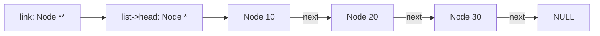
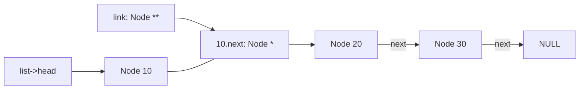

# 第 5 週課堂講義 — Linked Lists 與 Pointer-to-Pointer 技巧

> 2026 年 10 月 6 日 · 來源沿革：先前的 linked-list 講義與 2025 年
> 第 1–3 週 notebooks；範例已整合，以明確的 ownership 為核心

> Python 銜接：[第 5 週 Python 對照補充教材](week05_python_companion.md)

---

## 學習路線

- **核心：**畫出 node ownership，使用 `Node**` link-location cursor 處理 head 與
  內部變更、reverse links 而不遺失 nodes，並 destroy list。
- **練習：**完成[第 5 週練習](lecture_exercises/week05_ex.md)，
  它刻意使用裸的 owning head pointer；之後再與
  [完整的 bare-head 範例](examples.c)比較。
- **輔助概念：**`struct List` representation 加入 cached size；
  circular lists 與 Josephus 是在穩固掌握 linear-list
  invariant 之後，用來比較的應用。
- **Python 銜接：**使用補充教材比較 references 與 mutation，同時
  明確保留 C allocation 與 ownership 的概念。

---

## 學習目標

完成本次課堂後，你應該能夠：

1. 使用 dynamically allocated nodes 表示 singly linked list。
2. 實作 insertion、removal、traversal 與 destruction。
3. 使用 pointer-to-pointer，以一致方式更新 link。
4. 陳述 list invariants 與 ownership 規則。
5. 比較 linked-list 與 array 的 operation 成本。
6. 指定並測試 indexed insertion、removal、filtering 與 subrange reversal，
   避免遺失 nodes 或 dereferencing 已 freed 的 storage。

---

## 三小時課程規劃

| 小時 | 主要問題 | 課堂產出 |
|------|---------------|---------------------|
| 1 | linked structure 如何 represented 與 owned？ | 手動 Build、印出並驗證 list |
| 2 | 一個 algorithm 如何更新 head 或內部的 link？ | 透過 pointer-to-pointer 推理實作 insertion、removal 與 reversal |
| 3 | 什麼情況適合使用 circular linked representation？ | 解決並比較 Josephus implementations，再執行 memory tests |

每小時交替安排講解、pointer diagrams、現場寫程式與簡短
練習。標示為**課堂核心**的練習屬於規劃中的課堂
路線。當班上需要更多時間追蹤 links 時，標示為**延伸**的練習可移到 lab 或自主
學習時進行。

### 隨堂練習流程

對每個**立即練習**活動：

1. 畫出每個 node 與 own 它的 link；
2. 預測變更的 links、return value、output 或 diagnostic；
3. 完成要求的最小修改或 trace；
4. 使用 `-std=c17 -Wall -Wextra -Wpedantic` compile 有效的程式碼；以及
5. 解釋為何每個 node 都仍恰好 reachable 一次，或已 released。

一開始只顯示題目。完成並檢查嘗試後，再開啟**展開解答**。
解答會提供預期 output、完整的 link
trace，或說明範例本身為何沒有 run-time output。

- **課堂核心：**屬於規劃中的課堂學習路線。
- **延伸：**供 lab、課間休息或日後自學使用的額外練習。

課堂核心活動在第 1 小時合計約 21 分鐘、第 2 小時約 24 分鐘，
第 3 小時約 20 分鐘。其餘時間用於講解、現場寫程式、
提問、課程銜接與短暫休息。

---

## 第 1 小時 — Representation、construction 與 ownership

> **第 1 小時路線：**[為何要 link nodes？](#1-為何要-link-nodes)
> → [Representation 與 invariants](#2-representation-與-invariants)
> → [本週使用的兩種 interfaces](#本週使用的兩種-interfaces)
> → [共同的 API preconditions](#共同的-api-preconditions)
> → [安全地 allocate 一個 node](#3-安全地-allocate-一個-node)
> → [將 payload 與 structure 分開](#將-payload-與-structure-分開)
> → [在最前端 insert](#4-在最前端-insert)
> → [在開發期間驗證 invariant](#在開發期間驗證-invariant)
> → [construction trace](#第-1-小時-construction-trace)

### 1. 為何要 link nodes？

array 會將 elements 連續儲存。linked list 則將每個 element 存在
指向下一個 node 的 node 中。

```text
head
  |
  v
+-------+------+    +-------+------+    +-------+------+
|  10   |   o--+--->|  20   |   o--+--->|  30   | NULL |
+-------+------+    +-------+------+    +-------+------+
```

這允許 insertion 時不必移動後面的 elements，但代價是每個 node 多一個 pointer、
non-contiguous memory access，以及 linear-time indexing。

#### 立即練習 [課堂核心] — 比較一次 insertion（3 分鐘）

畫出包含 `10, 20, 30` 的 array 與上面的 list。在兩種 representation 中都將 `15` insert 到
`20` 之前。哪些既有 values 或 links 必須改變？

<details>
<summary>展開解答</summary>

array 必須先將 `20` 與 `30` 向右移動一個位置，再儲存
`15`。在 list 中，新的 node allocated 並 initialized 之後，只有
兩個 links 會變：

```text
before: 10.next -> 20
new:    15.next -> 20
after:  10.next -> 15
```

兩種 representations 的 logical sequence 都會變成 `10, 15, 20, 30`。這是
link 與成本的 trace，並非完整程式，因此沒有 run-time output。

</details>

---

### 2. Representation 與 invariants

```c
#include <stdbool.h>
#include <stddef.h>

struct Node {
  int value;
  struct Node* next;
};

struct List {
  struct Node* head;
  size_t size;
};
```

我們的 representation invariant 如下：

- `head == NULL` 當且僅當 `size == 0`；
- 沿著 `next` 前進會恰好經過 `size` 個 nodes，然後到達 `NULL`；
- 每個 reachable node 都由這個 list owned；
- 沒有 node 會 reachable 兩次（list 沒有 cycle）。

#### 立即練習 [課堂核心] — 測試 representation invariant（3 分鐘）

將這些 states 分類為有效或無效：`(head == NULL, size == 0)`、一個
reachable node 但 `size == 0`、三個 reachable nodes 且 `size == 3`，以及
最後一個 link 指回第一個 node 的 three-node chain。

<details>
<summary>展開解答</summary>

| State | 是否有效？ | 原因 |
|-------|--------|--------|
| `head == NULL`、`size == 0` | 是 | 空的 representation 滿足所有條件 |
| 一個 reachable node，`size == 0` | 否 | emptiness 與 reachable-node count 不一致 |
| three-node chain 結束於 `NULL`，`size == 3` | 是 | count、ownership 與 termination 一致 |
| 最後一個 node link 回第一個 | 否 | traversal 形成 cycle，且 node 會重複 reachable |

這些是 representation states，而非實際執行，因此沒有
standard output。表格就是預期的 invariant trace。

</details>

---

### 本週使用的兩種 interfaces

課堂使用 `struct List`，因為 public container abstraction 可以 cache
它的 size，並保護更大的 invariant。練習 starter 刻意
移除該 wrapper 並傳遞 `Node** head`，讓 link-location 技巧
能在較少的周邊程式碼中清楚呈現。兩者可依下列方式轉換：

| 課堂 representation | 練習 representation |
|------------------------|-------------------------|
| owning link `list->head` | owning link `*head` |
| owning link 的 address `&list->head` | 已作為 `head` 接收的 address |
| cached `list->size` | 透過逐一走訪 nodes 判定 boundaries |

不要在同一個 implementation 中混用這兩組 functions。owning-link
推理完全相同，但 public operations 刻意不同：

| 課堂 operation | 聚焦練習的 operation |
|-------------------|----------------------------|
| push-front 與 sorted insertion | insert 到 numeric index 之前 |
| 按 value 進行 remove-first 與 remove-all | 在 numeric index 位置 erase |
| reverse 整個 list | reverse 一段 half-open index range |
| clear 一個 `struct List` | destroy 一個裸的 owning head |

課堂與 starter 都使用 `bool` 表示 operations 成功或失敗。之後
的 refactor 可以將練習的 head pointer 放進 `struct List`，並在
每次成功 mutation 後更新 cached size，但仍必須保留
所選 operation 的 contract。

#### 立即練習 [延伸] — 轉換一個 owning link（3 分鐘）

對可能替換 head node 的 function，寫出
bare-head 練習的 parameter type，並指出哪個 expression 會提供
課堂 `struct List` representation 中對等的 link location。

<details>
<summary>展開解答</summary>

bare-head function 接收 `struct Node** head`。使用 `struct List* list` 時，
對應的 link location 是 `&list->head`，其 type 同樣是
`struct Node**`。這個 type 練習沒有 run-time output。

</details>

---

### 共同的 API preconditions

除非 function 另有說明，下面每個 `struct List*` parameter 都必須
為非 `NULL`，並指向已 initialized、有效且 acyclic 的 list。這些範例
使用該 precondition，而不是在每個
operation 中重複 defensive null check。

- `list_init` 是例外：其非 `NULL` argument 指向 writable
  `struct List` storage，members 尚不必 initialized。
- `list_is_valid` 是另一個例外：list object 與每個 traversed
  pointer 都必須可讀且 live，但 cached size 或 acyclic invariant
  可以有錯，因為這些正是它檢查的性質。
- borrowed node position 在 operation 指定的期間內，
  都必須保持 live 且屬於要求的 list。
- `list_print` 額外要求非 `NULL` 的 writable stream。
- allocation 失敗或 position 遭拒絕時，必須維持原本的 list
  不變。

在將 node 提供給 list 之前，initialize 每個 link。

```c
void list_init(struct List* list) {
  list->head = NULL;
  list->size = 0;
}
```

#### 立即練習 [課堂核心] — 建立 empty state（2 分鐘）

呼叫 `list_init(&list)` 後，畫出 `list.head`，並記錄 `list.size`。哪個
invariant 條件已經能在不 traversing 任何 node 的情況下檢查？

<details>
<summary>展開解答</summary>

```text
list.head -> NULL
list.size = 0
```

empty-state 的等價關係成立、traversal 經過零個 nodes，也沒有 node 能
重複出現。`list_init` 不會印出任何內容；兩行的 state trace 就是
預期結果。

</details>

---

### 3. 安全地 allocate 一個 node

```c
#include <stdlib.h>

static struct Node* node_create(int value, struct Node* next) {
  struct Node* node = malloc(sizeof(*node));
  if (node == NULL) return NULL;
  node->value = value;
  node->next = next;
  return node;
}
```

function 會回傳新 node 的 ownership，或以 `NULL` 回報失敗。
因為它是 `static`，所以是 `list.c` 的 private implementation detail。

#### 立即練習 [課堂核心] — 追蹤 node construction（4 分鐘）

以概念方式呼叫 `node_create(20, old_head)`。追蹤 allocation 成功與
allocation 失敗的情況。在哪條 path 上，caller 可以提供回傳的 pointer 給 list？

<details>
<summary>展開解答</summary>

```text
success: node -> {value: 20, next: old_head}; caller receives new ownership
failure: return NULL; old_head and every existing node remain unchanged
```

只有非 `NULL` 的結果可以成為 list link。function 沒有
standard output；可觀察的結果是回傳的 pointer 與 initialized
node state。

</details>

---

### 將 payload 與 structure 分開

link fields 描述 list 的**形狀**；其他 fields 是它的
**payload**，也就是 list 儲存的 data。將這兩種 roles 分開，
更容易把相同的 list 概念用在 integers、strings、tokens 或
game objects。node 可以 own heap-allocated string、borrow string，或
inline 儲存 bytes；這些選擇會改變 destruction 與 copy 行為。

```c
struct StringNode {
  char* text;
  struct StringNode* next;
};
```

中性的 field 名稱並未宣稱 ownership 政策。如果 `text` owns
copy，node creation 必須 duplicate string，且 node destruction 必須先 free 它，
再 freeing node。如果 `text` 是 borrowed，source string 必須 outlive
list。絕對不要在 API contract 中省略這項決定。

#### 立即練習 [延伸] — 選擇 string ownership contract（3 分鐘）

對 `text` owns copy 的版本，以及 node
borrows text 的另一個版本，陳述 creation 與 destruction 的責任。先不要撰寫
copying function。

<details>
<summary>展開解答</summary>

| 設計 | Creation | Destruction | Lifetime 要求 |
|--------|----------|-------------|----------------------|
| owned copy | 在提供 node 給 list 之前 allocate 並複製 text | free text，再 free node | 與 caller 原本的 string 無關 |
| borrowed text | 儲存提供的 pointer | 只 free node | source string 必須 outlive 每個 borrowing node |

這是 API-contract 練習，不會產生 run-time output。

</details>

---

### 4. 在最前端 insert

```c
bool list_push_front(struct List* list, int value) {
  struct Node* node = node_create(value, list->head);
  if (node == NULL) return false;
  list->head = node;
  ++list->size;
  return true;
}
```

順序很重要：先 allocate、將新的 node 接到舊的 head，
最後才替換 `head`。如果 allocation 失敗，原本的 list 維持不變。

#### 立即練習 [課堂核心] — 安全地提供新的 head（4 分鐘）

從 `10 -> 20 -> NULL` 且 `size == 2` 開始，追蹤
`list_push_front(&list, 5)`。給出最後的 sequence 與 size。接著追蹤
allocation-failure path。

<details>
<summary>展開解答</summary>

```text
success:
  allocate node {5, old head}
  list.head -> 5 -> 10 -> 20 -> NULL
  list.size = 3
  return true

failure:
  list.head -> 10 -> 20 -> NULL
  list.size = 2
  return false
```

`list_push_front` 本身不會印出任何內容。搭配第 3 小時的 `list_print`，
成功後的 state 會印出 `5 -> 10 -> 20`，再接一個 newline。

</details>

---

### 在開發期間驗證 invariant

```c
bool list_is_valid(const struct List* list) {
  size_t observed = 0;
  const struct Node* node = list->head;
  while (node != NULL) {
    ++observed;
    if (observed > list->size) return false; /* cycle or wrong size */
    node = node->next;
  }
  return observed == list->size;
}
```

這個有限次的檢查可以偵測許多 malformed representations，但無法偵測全部。
在 public-operation boundaries 搭配 `assert(list_is_valid(list))` 呼叫它，
用於開發期間。`assert` macro 來自 `<assert.h>`，會在
condition 為 false 時停止 debugging 執行；它用於 programmer invariants，並非可恢復的 input 或
allocation failures，而且 build 可以透過 `NDEBUG` 停用它。稍後請比較
這個檢查與 Floyd's tortoise-and-hare cycle detector；後者不依賴
`size`。

#### 立即練習 [延伸] — 追蹤 validation loop（4 分鐘）

對 `10 -> 20 -> 30 -> NULL`，追蹤 `observed` 當 `size` 為 `3`，以及錯誤地設為
`2` 時的值。什麼條件能避免意外的 cycle 讓
這個特定的檢查永遠 loop 下去？

<details>
<summary>展開解答</summary>

```text
size 3: observed becomes 1, 2, 3; traversal reaches NULL; return true
size 2: observed becomes 1, 2, 3; 3 > 2; return false immediately
```

對 cycle 而言，`observed` 最後會大於 cached `size`，因此
function 回傳 `false`。它不會印出任何內容。但仍依賴 `size`
是合理的有限 bound；Floyd's algorithm 不需要
這個 cached field，就能偵測 cycle。

</details>

---

### 第 1 小時 construction trace

#### 立即練習 [課堂核心] — build 時不遺失舊的 head（5 分鐘）

從空的 list 開始，依序 push `30`、`20`、`10`。畫出每個 allocation
在 head 更新前後的狀態。再讓第三次 push 強制 allocation 失敗，
重做一次，並證明原本的 two-node list 仍維持有效且 owned。

<details>
<summary>展開解答</summary>

```text
initial:        head -> NULL, size 0
push 30:        head -> 30 -> NULL, size 1
push 20:        head -> 20 -> 30 -> NULL, size 2
push 10:        head -> 10 -> 20 -> 30 -> NULL, size 3

forced failure on push 10:
                head -> 20 -> 30 -> NULL, size 2
```

在提供新 node 給 list 之前，caller 透過 local
`node` pointer own 新的 allocation，而 `list->head` 仍 own 舊的 chain。已 initialized 的
`node->next` 是事先準備、連到該 chain 的 link，而不是第二個已公開的 owner。
Assign `list->head = node` 會確認 mutation：head link own 新的
node，而新 node 的 `next` 成為指向原本
head 的唯一 incoming link。失敗時不會有新的 node，舊的 head 也不會被 overwritten。
除非 driver 呼叫 `list_print`，否則 functions 不會產生 standard output。

</details>

---

## 第 2 小時 — Link-location algorithms

> **第 2 小時路線：**[Link 是可修改的位置](#5-link-是可修改的位置)
> → [依 sorted order 進行 insert](#6-依-sorted-order-進行-insert)
> → [就地 reverse](#就地-reverse)
> → [Remove 所有 matching nodes](#remove-所有-matching-nodes)
> → [選用的補充練習](#選用的補充練習)
> → [Sequence-editor 案例研究：重新接 links 之前先指定規格](#sequence-editor-案例研究重新接-links-之前先指定規格)
> → [為四個 operations 設計 invariants](#為四個-operations-設計-invariants)
> → [Edge-case matrix](#edge-case-matrix)
> → [Sequence-editor 檢查點](#sequence-editor-檢查點)

### 5. Link 是可修改的位置

Removing node 通常必須改變 `list->head`，或改變
前一個 node 的 `next`。pointer-to-pointer 讓同一個 loop 將兩者都視為
「指向目前 node 的 link」。

重要概念是 `link` 指向**存放 node
pointer 的格子**，而不是直接指向 node：



經過一個 loop step 後，`link = &(*link)->next` 讓同一個 variable 指向
第一個 node 內部的 `next` 格子：



因此，寫入 `*link = ...` 會改變目前 own
node 的 incoming link：可能是 `list->head`，也可能是某個 node 的 `next` field。

Linus Torvalds 在 TED2016 訪談中，以這組 linked-list deletion 的對比
示範程式設計的「品味」。傳統 traversal 會記住
前一個 node，然後需要特別處理 head 的 branch：

```c
struct Node* previous = NULL;
struct Node* current = list->head;
while (current != NULL && current->value != target) {
  previous = current;
  current = current->next;
}
if (current != NULL) {
  if (previous == NULL) {
    list->head = current->next;
  } else {
    previous->next = current->next;
  }
  free(current);
  --list->size;
}
```

問題不在於這個版本無法運作。它的 state 描述 nodes，
但真正的 mutation target 是 **link**。直接表示這個 link，可以消除
人為的 head/interior 區分：

```c
bool list_remove_first(struct List* list, int target) {
  struct Node** link = &list->head;

  while (*link != NULL && (*link)->value != target) {
    link = &(*link)->next;
  }

  if (*link == NULL) return false;

  struct Node* removed = *link;
  *link = removed->next;
  free(removed);
  --list->size;
  return true;
}
```

沒有特別的 head-removal branch，因為 `link` 一開始就指向
head field 本身。這裡的「好品味」是選擇能讓
invariant 與 exceptional cases 消失的 representation；這不代表
增加 indirection 永遠比較好。

#### 立即練習 [課堂核心] — 沿著 owning link 前進（6 分鐘）

從 `10 -> 20 -> 30 -> NULL` 開始，追蹤 `link`、`*link`、變更的
incoming link、return value 與最後的 size，分別讓 target 為 `10`、`20`
與 `99`。每次 call 都獨立看待。

<details>
<summary>展開解答</summary>

| Target | 最後的 `link` location | 變更的 link | 結果 |
|--------|-----------------------|--------------|--------|
| `10` | `&list->head` | `list->head = removed->next` | `20 -> 30`、size 2、回傳 `true` |
| `20` | `&node10->next` | `node10->next = removed->next` | `10 -> 30`、size 2、回傳 `true` |
| `99` | `node30->next` 的 address | 無 | list 不變、size 3、回傳 `false` |

成功時，會先寫入 bypass link，再將 `removed` freed；
後面沒有 expression 會讀取 freed node。function 不會印出任何內容。搭配
`list_print`，兩個成功的最後 states 會分別印出 `20 -> 30` 與
`10 -> 30`。

</details>

---

### 6. 依 sorted order 進行 insert

```c
bool list_insert_sorted(struct List* list, int value) {
  struct Node** link = &list->head;
  while (*link != NULL && (*link)->value < value) {
    link = &(*link)->next;
  }

  struct Node* node = node_create(value, *link);
  if (node == NULL) return false;
  *link = node;
  ++list->size;
  return true;
}
```

loop invariant 如下：`*link` 之前的每個 node，其 value 都小於 `value`，
而 `link` 正是 insertion 必須更新的位置。

#### 立即練習 [課堂核心] — 在 owning location 進行 insert（4 分鐘）

從 `10 -> 30 -> 50` 開始，在兩次獨立執行中分別追蹤 insertion `30`，以及 insertion
`60`。`link` 會停在哪裡？equal values 會放在哪裡？

<details>
<summary>展開解答</summary>

```text
insert 30:
  link stops at the link owning the existing 30
  result: 10 -> 30(new) -> 30(old) -> 50
  size increases by one; return true

insert 60:
  link stops at the final NULL link
  result: 10 -> 30 -> 50 -> 60
  size increases by one; return true
```

嚴格的 `< value` condition 會將新的 equal value 放在既有 equal
values 之前。Allocation 失敗時，原本的 list 維持不變。function
本身不會產生 standard output。

</details>

---

### 就地 reverse

```c
void list_reverse(struct List* list) {
  struct Node* reversed = NULL;
  struct Node* remaining = list->head;

  while (remaining != NULL) {
    struct Node* next = remaining->next;
    remaining->next = reversed;
    reversed = remaining;
    remaining = next;
  }
  list->head = reversed;
}
```

Loop invariant：`reversed` own 已處理且順序反轉的 prefix；
`remaining` own 尚未處理的 suffix；兩者合起來恰好包含
原本的 nodes，且沒有 node 能從兩者同時 reachable。

#### 立即練習 [課堂核心] — reverse 時不遺失 suffix（5 分鐘）

追蹤 `reversed`、`remaining` 與儲存的 `next` pointer，針對
`10 -> 20 -> 30 -> NULL`。為何必須先儲存 `next`，再 assign
`remaining->next = reversed`？

<details>
<summary>展開解答</summary>

```text
start:  reversed = NULL          remaining = 10 -> 20 -> 30
step 1: reversed = 10 -> NULL    remaining = 20 -> 30
step 2: reversed = 20 -> 10      remaining = 30
step 3: reversed = 30 -> 20 -> 10, remaining = NULL
finish: list.head = reversed
```

儲存 `next` 會在目前 link reverse 之前，保留唯一指向尚未處理 suffix 的 pointer。
function 不會印出任何內容；之後使用 `list_print`
會產生：

```text
30 -> 20 -> 10
```

</details>

---

### Remove 所有 matching nodes

延伸 pointer-to-pointer pattern：

```c
size_t list_remove_all(struct List* list, int target) {
  size_t removed_count = 0;
  struct Node** link = &list->head;
  while (*link != NULL) {
    if ((*link)->value == target) {
      struct Node* removed = *link;
      *link = removed->next;
      free(removed);
      --list->size;
      ++removed_count;
    } else {
      link = &(*link)->next;
    }
  }
  return removed_count;
}
```

removal 之後，不要推進 `link`：它已經指向下一個要
檢查的 link。當相鄰的 nodes 都 match 時，這是關鍵情況。

#### 立即練習 [課堂核心] — remove 相鄰的 matches（4 分鐘）

追蹤 removal `2`（從 `1 -> 2 -> 2 -> 3 -> 2`）。記錄 link location
每次 removal 之後的 link location、回傳的 count，以及最後的 size。

<details>
<summary>展開解答</summary>

```text
skip 1:       link designates 1.next
remove 2:     1.next now owns the next 2; do not advance link
remove 2:     1.next now owns 3; do not advance link
skip 3:       link designates 3.next
remove 2:     3.next becomes NULL
final list:   1 -> 3 -> NULL
removed:      3
```

若原本的 size 是 5，最後的 size 就是 2。function 會回傳 `3`，
且不會印出任何內容。接著使用 `list_print` 會印出 `1 -> 3`。

</details>

---

### 選用的補充練習

#### 立即練習 [延伸] — 設計四個相關的 interfaces（6 分鐘）

擬定以下 operations 的 contracts 與 tests：

1. `list_find` 回傳 borrowed node pointer；
2. `list_insert_after` 接收 borrowed position；
3. `list_clone` 回傳順序相同的 deep copy；
4. `list_equal` 不將 nodes 暴露給 caller。

定義 position 不屬於 list 時的行為。決定
API 能否有效率地偵測這個情況，或必須將它列為 precondition。

<details>
<summary>展開解答</summary>

一個一致的設計如下：

| Operation | Ownership 結果 | 必要 tests |
|-----------|------------------|-----------------|
| `list_find` | 回傳 borrower 或 `NULL` | empty、first、last、absent |
| `list_insert_after` | list 保留每個 node 的 ownership | valid position、allocation 失敗、依 contract 處理 foreign position |
| `list_clone` | 回傳獨立的 owner 或回報失敗 | empty、數個 nodes、partial-allocation cleanup、source independence |
| `list_equal` | borrow 兩個 lists | 兩者 empty、size 不等、first mismatch、equal payloads |

判斷任意 position 的 membership 需要 traversal，除非 API 已指定
caller 必須提供從這個 list borrowed 的 node。這個區塊指定
contracts 與 tests，但未提供完整 implementations；因此沒有
run-time output。

</details>

---

### Sequence-editor 案例研究：重新接 links 之前先指定規格

考慮以 integer track IDs 的 singly linked list 表示的播放清單。
要求的 operations 刻意以 half-open、zero-based
positions 陳述：

- 在 position `position` **之前** insert track，允許 `position == size`；
- remove `position` 的 track，不存在時回報失敗；
- remove 每個滿足所提供 predicate 的 track；
- reverse node range `[first, last)`，讓其他所有 nodes 保持原位。

**predicate** 是透過 true/false 結果分類 element 的 function。
這個 operation 只有在提供的 predicate
接受 node 的 payload 時，才會 removes 該 node。

不要從 pointer assignments 開始。先決定 representation
使用真正的 head pointer，還是 dummy/sentinel node。sentinel 永遠不是播放清單
data；它能簡化 front mutations，但 size、traversal 與 destruction
都必須一致地排除它。混用兩種 representations，經常會導致
null dereferences 與意外的 sentinel deletion。

---

### 為四個 operations 設計 invariants

對 index walk，記錄 cursor 經過 `k` 個 links 後的意義，而不是
依賴「接近目的地」之類的 comments。對 link-location 設計，
實用的 invariant 如下：

```text
link designates the pointer field that owns the node at the current position
```

對 remove-all，不能跳過相鄰的 matches：unlinking 與
freeing node 之後，相同的 incoming link 現在指向下一個 candidate。對
subrange reversal，在整個 operation 期間都維持三個互不重疊的 regions：

```text
unchanged prefix | range being rearranged | unchanged suffix
```

在 regions 重新連接之前，每個原本的 node 都必須恰好從一個 region
reachable。改變或 freeing 目前的 node 之前，
先儲存任何需要的 successor。

---

### Edge-case matrix

撰寫 pseudocode 之前，先預測下列情況的行為：

| Operation | 定義 contract 的 cases |
|-----------|--------------------------------|
| Insert | empty list、front、middle、end、超過 end 的 position |
| Remove at | empty list、front、last、position 等於 size |
| Remove if | no match、head match、adjacent matches、每個 node 都 matches |
| Reverse range | empty range、一個 node、從零開始、結束於 size、invalid order |

畫出每個 accepted case 前後的 links。對 rejected cases，要求
list 維持不變。接著撰寫 function contracts 或 pseudocode，但不要寫
完整 implementation，並將圖示作為後續 tests 的 oracle。

---

### Sequence-editor 檢查點

#### 立即練習 [課堂核心] — 寫程式之前先追蹤 indexed edits（5 分鐘）

分別從 `11 → 22 → 33 → 44 → 55` 開始，畫出這些
operations：insert `99` 到 position 2 之前；remove position 3；remove 每個
小於 30 的 value；reverse `[1, 4)`；以及 reverse `[0, size)`。每一項都陳述
結果的 size，以及第一個改變的 incoming link。

<details>
<summary>展開解答</summary>

| Operation | 結果 | Size | 第一個改變的 incoming link |
|-----------|--------|------|-----------------------------|
| insert `99` 到 2 之前 | `11 → 22 → 99 → 33 → 44 → 55` | 6 | `22.next` |
| remove position 3 | `11 → 22 → 33 → 55` | 4 | `33.next` |
| remove values `< 30` | `33 → 44 → 55` | 3 | `head`，接著再使用同一個 head link |
| reverse `[1, 4)` | `11 → 44 → 33 → 22 → 55` | 5 | `11.next` |
| reverse `[0, 5)` | `55 → 44 → 33 → 22 → 11` | 5 | `head` |

每個 accepted edit 都會讓每個 retained node 的 ownership 恰好保留一次。
Removed nodes 必須 released；reversal 會改變 links，但不會 allocates 或
frees nodes。這些是預期的 state traces，而非完整 implementation code。

</details>

---

## 第 3 小時 — Traversal 變化、circular lists 與 Josephus

> **第 3 小時路線：**[Traversal 與 read-only borrowing](#7-traversal-與-read-only-borrowing)
> → [Destroy 整個 list](#8-destroy-整個-list)
> → [Complexity 與 representation 選擇](#9-complexity-與-representation-選擇)
> → [Circular lists 與 Josephus](#10-circular-lists-與-josephus)
> → [精確陳述 Josephus problem](#精確陳述-josephus-problem)
> → [Circular-list representation](#circular-list-representation)
> → [Josephus 比較](#josephus-比較)
> → [驗證](#第-3-小時驗證)

### 7. Traversal 與 read-only borrowing

`FILE*` 是 standard I/O library 的 stream handle。caller 可以傳入 `stdout`，
把內容印到 terminal，或傳入另一個 writable stream 選擇不同的
destination，而不必改變 traversal algorithm。

```c
#include <stdio.h>

void list_print(const struct List* list, FILE* stream) {
  for (const struct Node* node = list->head; node != NULL; node = node->next) {
    fprintf(stream, "%d%s", node->value, node->next == NULL ? "\n" : " -> ");
  }
}
```

function 會 borrows list，且不會 mutate 它。local traversal
pointer 是 non-owning；絕對不能傳給 `free`。

#### 立即練習 [課堂核心] — 預測 traversal output（3 分鐘）

對 empty list 呼叫 `list_print`，再對 `10 -> 20 -> 30 -> NULL` 呼叫。會將什麼
寫入 stream？function 可以修改哪些 objects？

<details>
<summary>展開解答</summary>

empty list 執行零次 loop iterations，不會寫入任何內容。nonempty
list 會寫入：

```text
10 -> 20 -> 30
```

最後的 node 會產生 newline。`const struct List*` 與
`const struct Node*` access paths 允許讀取，但不能修改 list 或
其 nodes；只有外部 stream 會改變。

</details>

---

### 8. Destroy 整個 list

```c
void list_clear(struct List* list) {
  struct Node* node = list->head;
  while (node != NULL) {
    struct Node* next = node->next;
    free(node);
    node = next;
  }
  list->head = NULL;
  list->size = 0;
}
```

儲存 `next` 必須在 freeing node **之前**。讀取 `node->next` 若發生在 `free(node)` 之後，
會造成 use-after-free。

#### 立即練習 [課堂核心] — 恰好結束每個 node lifetime 一次（4 分鐘）

追蹤 `list_clear` 對 `10 -> 20 -> 30 -> NULL` 的操作。每次 iteration 之後，指出
儲存的 successor、lifetime 結束的 node，以及剩下的 owner。

<details>
<summary>展開解答</summary>

```text
iteration 1: save 20; free 10; local node now advances to 20
iteration 2: save 30; free 20; local node now advances to 30
iteration 3: save NULL; free 30; local node becomes NULL
finish:      list.head = NULL; list.size = 0
```

loop 期間，local `node` pointer 暫時讓剩下的 chain
在舊的 head node released 之後仍 reachable。function 不會印出任何內容。
clear 之後呼叫 `list_print` 不會寫入任何內容，因為 list 已是 empty。

</details>

---

### 9. Complexity 與 representation 選擇

| Operation | Dynamic array | Singly linked list |
|-----------|---------------|--------------------|
| Index `i` | O(1) | O(i) |
| Push front | O(n) | O(1) |
| Insert 到已知 position 之後 | O(n) 次 shifts | O(1) |
| Find 一個 value | O(n) | O(n) |
| Cache locality | 良好 | 通常不佳 |
| Per-element overhead | 無 | 一個 link 與 allocator metadata |

Big-O 不代表 list 自動就會比較快。對許多 workloads 而言，
contiguous arrays 更有優勢，因為 allocation 與 memory locality 很重要。

#### 立即練習 [延伸] — 從 access patterns 做選擇（3 分鐘）

針對（a）頻繁的 random indexing，以及
（b）在已知的 position 之後反覆 insertion，選擇 array 或 singly linked list。陳述一項
Big-O notation 忽略的成本。

<details>
<summary>展開解答</summary>

- Random indexing 適合 array，因為到達 element `i` 的成本為 O(1)。
- 在已知 node 之後 Insertion 可能適合 linked list，因為重新接 links 是 O(1)；
  若 node 尚未已知，finding 該 node 仍需要 O(n)。
- Cache locality、allocation overhead、per-node memory 與 constant factors 都是
  Big-O notation 隱藏的成本範例。

這是設計比較，沒有 run-time output。

</details>

---

### 10. Circular lists 與 Josephus

> **Algorithm 應用：**必須掌握的 list 基礎是正確且 owned 的
> linear list。Circular links 與 Josephus 用來在穩固掌握這些
> invariants 之後比較 representations。

在 circular list 中，最後的 node 指回第一個，而不是 `NULL`。
這能為 Josephus problem 中反覆淘汰的過程建立模型，也會改變
invariant 與 termination condition：traversal 必須記住起始
node 或 count，而 destruction 必須刻意 break 或走訪 cycle。

使用 circular list 應是因為問題本身具有 circular 性質，而不是只因為它是
有趣的 structure。Josephus problem 也有 array 與數學
解法，各有不同的 tradeoffs。

---

### 精確陳述 Josephus problem

將 `n` 位參與者排成圓圈，編號從 `1` 到 `n`。從
參與者 `1` 開始。只計數仍在圓圈內的參與者；每數到第
`k` 位就將其 remove，再從下一位仍在圈內的參與者繼續計數。
持續到只剩一位參與者。一般題目要求找出 survivor；
有些版本也要求完整的 removal order。

對 `n = 7` 與 `k = 3`，數 `1, 2, 3`、remove `3`，再從 `4` 繼續：

| 回合 | 計數前的圓圈 | Removed | 下一個起點 |
|-------|------------------------|---------|------------|
| 1 | `1 2 3 4 5 6 7` | `3` | `4` |
| 2 | `4 5 6 7 1 2` | `6` | `7` |
| 3 | `7 1 2 4 5` | `2` | `4` |
| 4 | `4 5 7 1` | `7` | `1` |
| 5 | `1 4 5` | `5` | `1` |
| 6 | `1 4` | `1` | `4` |

removal order 是 `3, 6, 2, 7, 5, 1`；參與者 `4` 存活。這個手動
trace 明確釐清三項常見歧義：計數是否包含目前
參與者、從哪裡繼續計數，以及 removal 之後 labels 是否改變。

#### 立即練習 [課堂核心] — 套用計數慣例（4 分鐘）

完全使用上面的慣例，追蹤 `n = 5` 與 `k = 2`。展開解答之前，
先給出完整的 removal order 與 survivor。

<details>
<summary>展開解答</summary>

| 回合 | 計數前的圓圈 | Removed | 下一個起點 |
|-------|------------------------|---------|------------|
| 1 | `1 2 3 4 5` | `2` | `3` |
| 2 | `3 4 5 1` | `4` | `5` |
| 3 | `5 1 3` | `1` | `3` |
| 4 | `3 5` | `5` | `3` |

removal order 是 `2, 4, 1, 5`，參與者 `3` 存活。這個預期
trace 也能作為小型 array 或 circular-list implementation 的 oracle。

</details>

---

### Circular-list representation

實用的 representation 會儲存 `tail`，其 `next` 就是 head：

```c
struct CircularList {
  struct Node* tail;
  size_t size;
};

/* empty: tail == NULL
   nonempty: tail->next is head, and size links return to head */
```

tail 之後的 Insertion 是 O(1)，存取 head 也是 O(1)。Destruction 必須使用
儲存的 size，或先 break cycle；`while (node != NULL)` loop 永遠不會
終止。

#### 立即練習 [延伸] — 畫出 circular invariant（3 分鐘）

使用 `tail` representation，畫出 empty、singleton 與 three-node circular lists；
對每個 nonempty state，指出 `tail->next` 與
回到 head 所需的 links 數量。

<details>
<summary>展開解答</summary>

```text
empty:     tail = NULL, size 0
singleton: tail -> 1, 1.next -> 1, size 1
three:     tail -> 3, 3.next -> 1 -> 2 -> 3, size 3
```

對每個 nonempty state，`tail->next` 都是 head，而且從 head 沿著恰好
`size` 個 links 前進，就會回到 head。這些 declarations 與圖示
不會產生 run-time output。

</details>

---

### Josephus 比較

對 `n` 位參與者與 step `k`，比較三種方法：

| 方法 | 主要 state | 一般成本 | 自然產生的結果 |
|----------|------------|--------------|----------------------------|
| Array，erase 被 removed 的 entry | 剩下的 labels 與目前的 index | O(n²)，因為後面的 entries 會 shift | 完整的 removal order |
| Circular linked list | predecessor/current node 與 remaining count | O(nk) 次 link steps；removal 本身是 O(1) | 完整的 removal order |
| Recurrence `J(1,k)=0`、`J(n,k)=(J(n-1,k)+k) mod n` | 較小圓圈的 survivor index | iterative 作法使用 O(n) time、O(1) space | 只有 survivor |

recurrence 使用 zero-based positions。加上 1，就能回報
從 `1` 到 `n` 的參與者 label。原理是想像第一次 removal 之後，
較小的圓圈從新的起點重新編號；加上 `k` 會將
該答案對應回原本的編號。

recursive 與 iterative 版本表達相同的 recurrence。下面的 iterative
形式讓變動的 subproblem size 清楚可見，也避免為每位參與者使用一個
call-stack frame。它的 precondition 是 `count > 0` 與
`step > 0`；assertions 會在開發期間檢查由 programmer 控制的 calls，
但不是可恢復的 input validation：

```c
#include <assert.h>

static int josephus_survivor(int count, int step) {
  assert(count > 0);
  assert(step > 0);

  int survivor = 0; /* J(1, step), in zero-based numbering */
  for (int circle_size = 2; circle_size <= count; ++circle_size) {
    survivor = (int)(((long long)survivor + step) % circle_size);
  }
  return survivor + 1; /* convert to the labels 1 through count */
}
```

對 `count = 7` 與 `step = 3`，當 circle sizes
從 `1` 到 `7` 時，依序的 zero-based survivor positions 是 `0, 1, 1, 0, 3, 0, 3`；最後的 `+1`
因此回報參與者 `4`。這個 algorithm 無法產生 removal
order，因為該資訊不屬於它的 state。

需要完整 elimination order 時，structure-simulation
版本仍然很有價值。Algorithm 的選擇依要求的 output 而定。

#### 立即練習 [課堂核心] — 將 recurrence 連結到手動 trace（5 分鐘）

追蹤 `josephus_survivor(5, 2)`，記錄 `survivor` 隨 circle sizes 從 1
到 5 時的值。將回傳的 label 與先前的 elimination trace 比較。這個
function 若不使用另一個 algorithm，就無法印出什麼資訊？

<details>
<summary>展開解答</summary>

```text
circle size: 1  2  3  4  5
J(size, 2):  0  0  2  0  2
returned label: 2 + 1 = 3
```

包含 `printf("%d\n", josephus_survivor(5, 2));` 的 driver 會印出：

```text
3
```

這與手動 trace 一致。recurrence 只保留 survivor
position，因此無法重建或印出 removal order `2, 4, 1, 5`。

</details>

---

### 第 3 小時驗證

#### 立即練習 [課堂核心] — 將 traces 轉為 tests（4 分鐘）

在 AddressSanitizer 下執行 empty、singleton、adjacent-removal、head/tail 與 full-destruction cases。
對 circular 版本，還要測試 `k = 1`、
`k > n` 與 repeated wraparound。比較 elimination order，使用簡單的
array reference implementation，針對較小的 `n`。

<details>
<summary>展開解答</summary>

合格的驗證紀錄應包含：

| 類別 | 預期證據 |
|----------|-------------------|
| empty/singleton | 沒有 invalid dereference；size 與 head/tail invariants 成立 |
| adjacent removal | 每個 matching node 都 removed，沒有跳過任何一個 |
| head/tail mutation | owning boundary link 改為預期的 node |
| destruction | owner 變為 `NULL`；sanitizer 沒有回報 invalid access |
| Josephus `k = 1` | 參與者按 label 順序離開，直到剩下最後的 survivor |
| wraparound 與 `k > n` | array 與 circular simulations 產生相同的順序 |

確切的 sanitizer 文字依 platform 而定。有效的執行不應出現
sanitizer diagnostic；功能 output 必須與手動建立的 oracle 一致。
repository 的[完整 bare-head 練習範例](examples.c)會 builds
`10, 20, 30`、reverse 它、remove 中間的 node，並印出：

```text
30 10
```

</details>

---

## 期中專案連結 — Tokens 是 representation boundary

專案在辨識 tokens 時使用 linked representation，並可能
將它轉為方便 indexed parsing 的形式。對 empty input、一個 token、數個 tokens 與
invalid character，追蹤 incoming link、current token 與 list owner。
conversion 必須保留 token 順序，並定義
誰負責 releases 兩種 representations。

使用 AI 產生 adversarial input 類別，再將每個建議縮減為
明確的預期 token sequence 或預期 rejection。不要要求它填寫
計分的 parser TODOs。星期四的證據是手動 trace 與 test table，
將在第 7 週再次使用。

### 立即練習 [延伸] — 檢視一次 token conversion（5 分鐘）

選擇一個 three-token input。畫出 linked representation、indexed result，
以及 conversion 前後每個 allocation 的 owner。接著
在 partial conversion 期間加入一次 failure，並指出每項必要的 cleanup。

<details>
<summary>展開解答</summary>

正確的 trace 必須顯示兩種 representations 具有相同的 token 順序、
指出 conversion 是 copies 還是 transfers payload ownership，並讓每個 live allocation
恰好有一個 owner。partial failure 時，所有新建立的 indexed
storage 都必須 released；input list 則必須維持有效，除非已公布的
contract 明確 consumes 它。確切的 token values 依選擇的 input 而定，
因此 deliverable 是 ownership table 與 expected sequence，而不是
project implementation code 或單一固定的 output。

</details>

---

## 自我檢核

1. 畫出 removal 第二個 node 期間的 `link`、`*link` 與 `**link`。
2. 為何 traversal pointer 不是 owner？
3. 加入 `list_pop_front`，並陳述其失敗行為。
4. 為何 list representation 必須明確區分 sentinel 與
   data node？
5. removing node 或重新接一段 range 之前，必須儲存哪些 handles？
6. 哪個 invariant 可以偵測意外的 cycle？
7. 在 AddressSanitizer 下執行 insertion 與 removal tests。

---

## 重點整理

- linked list 是由個別 allocated nodes 組成的 chain。
- list own 每個 reachable node，且必須恰好 release 每個 node 一次。
- pointer-to-pointer 以一致方式表示正在檢查或改變的 link。
- Indexed edits 需要明確的 position 慣例，以及失敗時保持不變的
  contract。
- 即使 allocation 失敗，Mutation 仍應保留 invariants。
- 請根據 access patterns 與實際成本選擇 representation，而不是只看 Big-O。

---

## 選用延伸教材 — Doubly linked lists

doubly linked node 加入 `previous`。每次 mutation 都必須更新兩個方向；
invariant 要求在存在 neighbors 時，`node->next->previous == node` 與
`node->previous->next == node`。這讓已知 node 可以在 O(1) 時間 removal，
不必搜尋其 predecessor，但會增加 memory 與更多
破壞 links 的可能。

---

## 參考資料與來源教材

- [Linus Torvalds，*The mind behind Linux*（TED2016）](https://www.ted.com/talks/linus_torvalds_the_mind_behind_linux)
- [Linked lists](<https://github.com/htchen/i2p-nthu/blob/master/程式設計二/mid1/2-linked_list.md>)
- [Linked-list 補充講義](<https://github.com/htchen/i2p-nthu/blob/master/程式設計二/mid1/2-linked_list_sup.md>)
- [Josephus problem](<https://github.com/htchen/i2p-nthu/blob/master/程式設計二/mid1/3-josephus_problem.md>)
- [教師投影片：*Josephus Problem*](../../assets/references/josephus_lee.pptx)
- [2025 年第 1 週 notebook（Colab）](https://colab.research.google.com/drive/1Asu-XpzM8EfrB8ANf4ze4ejDUdgIFGq0)
- [2025 年第 2 週 notebook（Colab）](https://colab.research.google.com/drive/1U1VXgyhO50YCJUTD7BPrA-zvr6GTMHIr)
